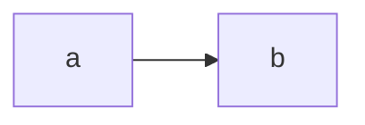

---

---

- Social rules to work with your Research assistant supervisors
	- 1. Helping the professor to understand your progress?
	- 2. When appearing in the lecture, mastering the rule of expressing gratitude to him? 

- Resource provided by prof. Mcmanus:

	- "Open ended issue" of teaching digital history - Journal of digital history
		- https://journalofdigitalhistory.org/en/cfp/teaching

	- Paper: The Ups and Downs of Training RoBERTa-based models on Smaller Datasets for Translation Tasks from Classical Chinese into Mandarin Chinese and Modern English
		- Leading a team of 6 undergraduate students

- More source:
	- https://melaniewalsh.github.io/Intro-Cultural-Analytics/06-Network-Analysis/00-Network-Analysis.html

---

---

- Suggestions:
	- Remove from syllabus: 
		- Marked up language
		- Parsing packages
		- Relational database
	- Adds to syllabus:
		- Simple machine learning, embeddings
		- 1. Data processing:

		- 2. Data storage: 

---

---

- What could be the possible products of these programming activities?
	- 

- Assignments / Labs / Self-guiding exercises: 
	- Review python commands, control flows
	- Using octoparse to extract some data from a webpage
	- 

---

- Possible Projects
	- Spotify song and playlist recommendation engine: https://www.mongodb.com/developer/code-examples/python/song-recommendations-example-app/

---

- Depending factors on how long it takes to complete the task:
	- If it is in-depth course, it may take longer
	- Existing material:
		- It there are already existing materials, resources, or curriculum guidelines, that can be adapted or built upon, it might save time. 
		- Conversely, if everything needs to be created from scratch, it can take longer.
	- Research and Content Development: 
		- Researching the subject matter, developing course content, creating assignments, and ensuring that the material aligns with the goals and standards of the Faculty of Arts can be time-consuming.

---
- Underlying concepts need to be taught in the course
	- 1. 

---

- The production pipeline in "HIST4702 digital history"

---

- The strategy of disconnecting dependencies

- Step 1: putting the dataset on github public repository: 

