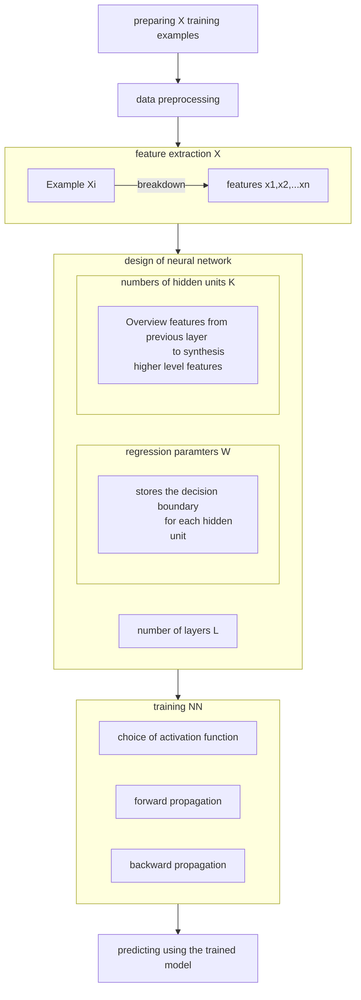

- 22-7-2022: created
![[Pasted image 20220925210307.png]]

---

---

- Course 1: 
Natural Language Processing with Classification and Vector Spaces

- Review:
	- Supervised ML (from deep learning course)
		- Preprocessing of data
			- 1. NLP
				- Sentiment analysis:
					- Stop words (and, is, are, at, has, for, a)
					- Punctuation (, . : ! " @ /)
					- Stemming (tuning --> tun, tune --> tun)
					- Lowercasing (Apple --> apple)
		- Feature extraction (Andrew Ng didn't cover that in all of his course!!!):
			- We want to reduce the features needed without reducing the accuracy of the prediction. 
			- Feature extraction is related to dimensionality reduction.
				- The key question is: How to make each feature independent to each other?
				- List of techniques: Principle component analysis (PCA), Independent component analysis (ICA), Linear discriminant analysis (LDA), Locally linear embedding (LLE), t-distributed Stochastic neighbor embedding (t-SNE), Autoencoder
			- Specific techniques in different type of ML tasks:
				- 1. NLP: 
					- a. bag-of-words 
						- There is a sequence of words, matching each word with pointing it to the bag of word, get the index of that word from the bag, and represent that word by that indexed word. 
						- $n = |V|$. No dimension reduction involved. The training and prediction time could be very large if the bag of words is large.
					- b. Sentiment 
						- Collect the bag of positive word and negative word. And then maps the sentence with pos/neg score individually for each word, instead of mapping the sentence with the unique words. Then accumulate back the "sentiment score" to represent the whole sentence.
						- Formally, The sentiment of the whole sentence becomes: $X_m=[1,\sum_w{freqs(w,1),\sum_w{freqs(w,0)]}}$, which 1 is called "bias" term, second element is "sum of positive frequencies", third element is "sum of negative frequencies".
				- 2. CNN: 
					- Edge detection (Convolution: it means the complexity of pattern reduces as we keep scale down the scope of the focus) (The process could be automatic) 
					- How to guarantee we are getting independent patterns from the CNN?
				- 3. RNN:
					- In my current knowledge (10 August 2022), 
						- Structurally, the RNN is basically a Markov machine. Each hidden units in RNN would get the training examples (word, time series) to match with the features it previously encountered. The structure of the latter layer is independent of time, that means, it has no difference to the former layer. 
						- However, when it runs each RNN hidden unit could consider the prediction result of its neighbor units if it is needed. The end-to-front connection is identical to front-to-end. $a_{output} =W_{aa}(a_{input\ 1},a_{input\ 2},\dots,a_{input\ K})$, which $a_{input\ 1}$ could comes from the previous layer, feeding from the training example iteself, or comes from the next layer.
							- Q: But would this opposite direction imports affects the computation?
			- Determining a subset of the initial features is called feature selection. 
			- The selected features are expected to contain the relevant information from the input data.
		- Settings: 
			- Training examples: $n=1,2,3,....K$
			- Features for each example, $X:[x_1,x_2,x_3,...]$ 
			- Parameters, $W:[\theta_0,\theta_1,\theta_2,...]$, which capture each features in this "set of training examples". 
			- Labels, $Y=[y_1,y_2,y_3,\dots, y_K]$, which contains the true value for each training example.
			- Linear regression $Z= WX + b$ 
			- Activation function $a(Z)$, which $a$ could be sigmoid function, ReLu function, general log function etc.
			- Total number of layers: $l=1,2,3,\dots,L$
		- Forward propagation (for any layer $l$): 
			- $a^{[1]}= g^{[1]}(W^{[1]} X+b^{[1]})$ for  $l=1$
			- $a^{[l]}= g^{[l]}(W^{[l]} \alpha^{[l-1]}+b^{[l]})$ for $l>1$, 
			- (final layer): $a^{[L]}\rightarrow \hat Y: [\hat y_1,\hat y_2,\hat y_3,...]$) 
			- Cost function = $J = {1 \over m}\sum_{n=1}^K(\hat Y - Y)^2$
		- Backward adaptation:
			- Choice of parameter change: 
				- For layer $l$, $a^{[l]}$ is composed by $w^{l}$, $a^{l-1}$, $b^l$. 
					- $a^{l-1}$ cannot be changed directly.
					- $b^l$ won't change the shape of decision boundary
					- $w^l$ is the top choice of changing the NN.
			- Gradient descent (for any layer $l$)
				- For each training example:
				- $${\partial J(g(W^{[l]},a^{[l-1]})) \over \partial W} = {\partial J \over \partial \hat Y}{\partial \hat Y \over \partial g}{\partial g \over \partial{W^{[l]}}} \tag{chain rule}$$
				- then we have: 
				- $${\partial J(g(W^{[l]},a^{[l-1]})) \over \partial W}= 2(a^{[l]}-y)(g'(z))(\alpha^{[l-1]}) \tag{for l>1}$$ 
				- $${\partial J(g(W^{[l]},a^{[l-1]})) \over \partial W}= 2(a^{[l]}-y)(g'(z))(X) \tag{for l=1}$$ 

			- Backpropagation (for any layer $l$): 
				- $w_{new}^{[l]}=w_{old}^{[l]}- \alpha{\partial J \over \partial W^{[l]}}$ for $l \in N$
			- Output: trained NN that is ready for making prediction.

---

- $n = |V|$

- Negative and positive frequencies
	- Word show up in positive / negative class
	- association: "I am happy because I am learning NLP": "happy" in PosFreq = 1. 
	- Some connectives might connect to both sentiments like "I am..."
	- Some sentence has negations in it. Like "is not"
- Feature extraction with frequencies
	- Encode a tweet as a vector with dimension V. (The size of the dictionary)
	- The words that don't appear on th4e sentence is not included. 
![[Pasted image 20220925210325.png]]
![[Pasted image 20220925210333.png]]

- Preprocessing
	- Stop word: stemming and stop words to preprocess your texts. 
		- 1. Remove words that don't add significant meaning to the tweets. (aka. stop words) and punctuations.
		- 2. Handling "handles" and URLs: those don't have values in sentiment analysis
		- 3. Stemming and lowercasing: 
			- Stemming: transforming words to its base form.

- Put all together
	- Use the above concepts to generate matrix. 
	- 1. Preprocessing
		- Original sentence --> Each sentence becomes a list of single word that has sentiment 
	- 2. Feature extraction:
		- That list of single word --> Filled with "bias" + 2 slot of positive / negative values.
	- 3. Single tweet sentiment: eg:  (1,4,2) : (bias, posFreq, negFreq)
	- 4. Aggregating back all training examples: 
		- $\begin{bmatrix} 1 & X_1^{(1)} & X_2^{(1)} \\ 1 & X_1^{(2)} & X_2^{(2)} \\ \vdots & \vdots & \vdots \\ 1 & X_1^{(m)} & X_2^{(m)} \end{bmatrix}$
		- That contains the sentiment results of all tweets. 

- In programming: 
![[Pasted image 20220925210344.png]]

- Week 2:
- Naive Bayes (Operations, smoothing and log-likelihood analysis)
	- Bayes
		- Corpus of tweet: "happy" can appears on some positive and some negative tweets. Why is it?
			- Guess a positive tweet: $$P(A=Pos) = {N\ of \ pos \ corpus \over N\ of \ corpus}$$
			- Guess a positive corpus of a tweet, let $A=N_{pos}$,  $B=Pos$, and plug it into Bayes' rule: 
				- $$P(A|B) = {P(A \cap B) \over P(B)}$$
				- Derived from: $P(A \cap B) = P(A|B)P(B)$
	- Naive bayes
		- Naive: this method makes the assumption that the features you are using for classification are all independent. Independent means it is not affected by the context of the word. 
		- Problem of Bayes:
			- 1. Look at how many words have a nearly identical conditional probability (especially: connective words. )
		- Naive bayes:
			- 1. For each unique word $w_i$: $$P(w_i|class) = {P(w_i \cap class) \over P(\sum{w_i}|class)} = {freqs(w_i \cap class) \over N_{class}}$$
				- $N_{class}$ is the total number of words in that training example. 
			- 2. For each tweet: 
				- Class ratio expressed as:$$Class\ Ratio(w_i)=\prod_{i=1}^m {P(w_i|pos) \over P(w_i|neg)}$$
					- The $\lambda(w)$ term will be demonstrated to be useful after we introduce the logarithmic operation.
				- Prior ratio expressed as: $$Prior \ Ratio ={P(pos) \over P(neg)}$$
				- Tweet is classified as positive if $$(Class\ Ratio)\times(Prior Ratio)={P(pos) \over P(neg)} \times (\prod_{i=1}^m {P(w_i|pos) \over P(w_i|neg)})>1$$
		- Laplacian smoothing
			- Original: $$P(w_i|class) = {P(w_i \cap class) \over P(\sum{w_i}|class)} = {freqs(w_i \cap class) \over N_{class}}$$
				- $N_{class}$ is the total number of words in that training example. 
			- Now (With laplacian smoothing): $$P(w_i|class) = {P(w_i \cap class) \over P(\sum{w_i}|class)} = {freqs(w_i \cap class)+1 \over N_{class}+V_{class}}$$
				- $N_{class}$ is the total number of words in that training example.
				- $V_{class}$ is the total number of unique words in that training example.
			- This Laplacian smoothing avoids the probability being zero. 
				- The problem of some words within a class being zero is, during $\prod$ a chain of words, some words might gives you a value that is undefined because of "divided by zero".
		- Log-likelihood
			- Way more convenient to work with, and appeared throughout deep learning and NLP. 
			- Products multiplies many values between 0 and 1. A value that is too small in the computer will causes underflow and would cause inaccuracy and slower computation overall. 
			- $log(a \times b) = log(a) + log(b)$
			- $$log({P(pos) \over P(neg)} \times \prod_{i=1}^m {P(w_i|pos) \over P(w_i|neg)}) = log{P(pos) \over P(neg)} + \sum_{i=1}^m log{P(w_i|pos) \over P(w_i|neg)}$$
			- Namely, the log of the likelihood of each tweet is in class X = "log prior" + "log likelihood" 
			- To predict that tweet has positive meaning, we need: $$log({P(pos) \over P(neg)} \times \prod_{i=1}^m {P(w_i|pos) \over P(w_i|neg)})>0$$
		- Summarize:
			- $$Word \ sentiment = \begin{cases} ratio(w) = {P(w_i|pos) \over P(w_i|neg)}\\ \lambda(w_i)=log{P(w_i|pos) \over P(w_i|neg)}\end{cases}$$
			- $$Tweet\ sentiment = \sum(Word\ sentiment)$$
	- Testing naive bayes
		- 1. Prepare a validation set of training example: $X_{val}$,$Y_{val}$
		- 2. compute $score=predict(X_{val},\lambda,logprior)$
		- 3. compute "pred = score > 0" for each validation set training example
		- 4. Obtain the accuracy by $${1 \over m}\sum_{i=1}(pred_i==Y_{val_i})$$
			- which $pred_i==Y_{val_i}$ count as 1 if that example we get a match.
	- Application of Naive Bayes
		- Spam filtering (using information taken from the sender)
		- Author identification (if we have two large corporal)
		- Information retrieval:
			- $$P(document_k|query) = \prod_{i=0}^{|query|}P(query_i|document_k)$$
			- (Given that you have an algorithm to determine whether each document fits the criteria)
			- Compute the likelihood for each document in your dataset, and then store the documents based on its likelihoods.
			- Retrieve document if P > threshold or retrieve top m documents with the biggest probability.
		- Word disambiguation:
			- Bank: bank(river), bank(finance). Test it is whether possible with: 
			- $$P(class) ={P(river|text) \over P(money|text)} > 1$$

---

- Week 3: Vector space model, PCA algorithm

- Natural language background:
	- Same meaning without using the same word
		- "Where are you" heading VERSUS "Where are you" from --> different meaning
		- "What is your age" VERSUS "How old are you" --> same meaning
	- Dependency between words
		- "You eat cereal from a bowl" --> dependency between "cereal" and "bowl"
		- "You buy something and someone else sell it" --> "buy" and "sell" are dependent.

- In vector space model
	- the way that representations are made by identifying the context around each word in the text
	- this captures the relative meaning.
	- represent words and documents as vectors
- Concept: "You shall know a word by the company it keeps" -- Firth, 1957
- Applications:
	- answer 5Ws questions
	- Information extraction
	- machine translation
	- chatbots.

---

- How a vector space can show relationships between words/documents?

- Co-occurrence matrix: 
	- construct your vector representation for your corpus. 
- k=K bandwidth
	- When doing word by word design, we count those word appears within k words of our words. eg: k=2, then we only record those words which are co-occurrence within 2 words. 
- Word by word design: 
	- For each word, the number of times of the co-occurrence with another words is recorded as attributes(dimensions) of the matrix. If each word is putting on the row, words "attributes" will be put in the column,.
- Word by document design:
	- For word-by-document design, there is no "k=K" bandwidth. The whole corpus would be treated as a whole unit. 
	- For each word, the number of times of the co-occurrence on each "themes" is recorded as attributes(dimensions) of the matrix. If each word is putting on the row, "attributes" will be put in the column.

- Similarity
	- Similarity of "attributes" is measured by "co-occurrence" matrix, which choosing 2 adjacent-attributes as the basic vector of a 2-dimensional vector space.  If you are comparing row elements, use column elements as your dimension, vice versa.
![[Pasted image 20220925210400.png]]

- [[Frobenius norm]]

- "Norm" in mathematics:
	- Definition: A norm is any function $f$ that satisfies:
		- $f(x)=0 \Rightarrow x=0$
		- $f(x+y) \leq f(x)+f(y)$ (Triangle inequality)
		- $\forall \alpha \in R, f(\alpha x)=|\alpha|f(x)$ (Linearity)
	- We can define many functions satisfies these conditions.
		- Vector norms:
			- Euclidean norm: $||v||_p=(|v_1|^2+|v_2|^2+\dots+|v_n|^2)^{1 \over 2}$
			- 1-norm: $||v||_1=|v_1|+|v_2|+\dots+|v_n|$
			- p-norm: $||v||_p=(|v_1|^p+|v_2|^p+\dots+|v_n|^p)^{1 \over p}$
			- infinite-norm: $||v||_\infty=max(|v_1|,|v_2|,\dots,|v_n|)$
		- Matrices norm:
			- Matrix norm is a vector norm in a vector space whose elements (vectors) are matrices (of given dimensions).
			- youtube - ritvikmath -  go back to the definition of a matrix: 
				- Matrix is not just a some kind of number grid
				- Matrix is a kind of linear transformation. It is a function that takes vector and then maps into other kind of vector.
			- Frobenius norm: $A_F=(\sum_{i,j}A_{i,j}^2)^{1 \over 2}$
			- Frobenius norm looks very similar but actually not the same as Euclidean norm. 
	- Application
		- 1. Calculate the "size" of a vector. 
		- 2. Calculate the distance between two tensors.
	- In machine learning, everything are represented as vectors. Such as feature $X=\{X_1, X_2\}$, we can represent it to be $a = \begin{bmatrix}x_1\\x_2\end{bmatrix}$
- Euclidean norm: 
	- Say we have a matrix $A$, Euclidean norm is defined as the square root of the sum of the absolute squares of its elements: $$||A_F||=\sqrt{\sum_{i=1}^m \sum_{j=1}^n|a_{ij}|^2}$$
	- Euclidean norm can also be considered as a vector norm.
- Euclidean distance:
	- To calculate the end point distance d between two vectors $\vec v$ and $\vec w$: 
	- Euclidean distance = Calculating the Euclidean norm of the difference of two vectors. The difference of two vectors represents the distance of two vectors and the Euclidean norm is the way of calculate the magnitude of it.
	- Euclidean distance: $$d(\vec v,\vec w)=\sqrt{\sum_{i=1}^n(u_i)^2}=\sqrt{\sum_{i=1}^n (v_i-w_i)^2}$$, which $u$ is the difference of two vectors$,i$ is the dimension of the vector space.
	- For example, we have $v_1$ = film, $v_2$ = data, Corpus A has (500,7000) and Corpus B is (9320,1000). The Euclidean distance between two corpus $d(A,B)=\sqrt{(B_1-A_1)^2+(B_2-A_2)^2}$

- Cosine similarity:
	- Problem of Euclidean distance: We might have two parallel vectors that could be actually similar. This comes from two similar vector, but corpora are different size.
	- Angle between two vectors: $$cos(\beta)={\vec v \cdot \vec w \over||\vec v|| \cdot ||\vec w||}$$
	- Dot product of $\vec v$ and $\vec w$: $$\vec v \cdot \vec w= \sum_{i=1}^n v_i \cdot w_i$$, which i is the dimension of the vector space.

- Manipulating words in vector spaces
	- Paper: Mikolox et al (2013): Distributed representation of words and phrases and their compositionality.
	- Relationship = $\vec v_1 - \vec v_2$

- PCA (reducing dimensions)
	- PCA reduces data dimension which has dimension>2.
		- eg: visualization of word vectors:
			- gas and petroleum, city and town are very close (???)
		- Original space --> Uncorrelated features --> Dimension reduction
![[Pasted image 20220925210418.png]]

- The end up result on data. That words with similar part of speech tags are next to one another. Synonyms and antonyms tend to be found next to each other in the plot.
![[Pasted image 20220925210423.png]]

- PCA algorithm
	- 1. Get the mean normalize of your data
	- 2. Get Covariance matrix
	- 3. Perform SVD

- Eigenvector: uncorrelated features
- Eigenvalue: the amount of information retained by each feature.

---

- Week 4: Machine translation
- Locality sensitive hashing
- Overview of translation
	- 1. Find someone who knows both languages to start making a list. We need both list of English word and French word equivalents. Keep the rows lined up. 
	- 2. Machine calculate word embeddings (word vectors) associated with English, and word embeddings (word vectors) associated with French. 
	- 3. Retrieve English word embedding of a particular English word (eg: cat: embedding: `[1,0,1]`)
	- 4. Find some ways to translate that English word embedding into word embedding that has the meaning in the French word vector space. (eg: Cat in French: `[2,3,2]`)
	- 5. Take the transformed word vector and search for word vectors and the candidate French word vector space that are most similar to it. 
- We define transformation matrix and denote it as $R$. So we have $XR = Y$. We minimize the distance between XR and Y, in order to get R.
- The nice thing is, you can just collect a subset of translation, to find your transformation matrix. And it works well, the model can be used to translate words that are not part of your original training set. 

- Solving for R
	- 1. $Loss =||XR-Y||_F$. Think of it as a measure of how far apart the attempted translation, and the French vectors are.
	- 2. Compute the gradient by $g = {d \over dR}Loss$
	- 3. Update the translation matrix by $R_{new} =R_{old}- \alpha g$

- Compute Frobenious norm / Matrix norm.
	- Matrices or vectors embraced with double vertical lines above are Frobenius norm of it. Frobenius norm of vectors or matrices are measuring the magnitude or the norm of a matrix.
	- Let say we have a 2 word (rows), 2 dimensions (columns) English dictionary. $A = \begin{pmatrix} 2 & 2\\ 2&2 \end{pmatrix}$.
	- Frobenious norm: $$||A||_F=\sqrt{\sum_{i=1}^m \sum_{j=1}^n|a_{ij}|^2}$$
	- There is very weird to imagine the physical meaning of Frobenius norm of a matrix. Steve Brunton: Imagine reshaping a (n,m) matrix into a (n \times m,1) vector 
	- $||A_F||=\sqrt{2^2+2^2+2^2+2^2}=4$

- Euclidean distance versus Frobenious norm: 
	- Frobenious norm, is to calculate the distance between vectors. 
	- Recall Euclidean distance: $$d(\vec v)=\sqrt{\sum_{i=1}^n(u_i)^2}$$, which $i$ is the dimension of the vector space. This formula can be proven by Pythagorean theorem.
	- For Frobenious norm, we try to plug in 

- K-nearest neighbors
	- Finding k-nearest neighbors of a vector.
	- Who do you find your friends who are living nearby?
		- Your can sort your friends by distance to your hometown, then rank them by how close they are.
		- If there is a way to slice the geographic space into regions, you can search just within those regions. Buckets = Hash tables. 

- Hash table
	- Imagine 3 buckets, 
		- "hash=0" bucket: circles
		- "hash=1" bucket: rectangles
		- "hash=2" bucket: triangles
	- word vectors
		- 1 dimension instead of 300 dimensions.
		- eg: 100, 14, 17, 10, 97. Find a way to give every number a hash.
		- Hash function(vector) --> value.
		- "Hash=0" bucket: 100, 10. "Hash=7" bucket: 17, 97
		- Pattern: Hash value = "vector % number of buckets". The elements in the same buckets do not have to be "nearby" each others.
	- create a basic hash table
		- Ideally, you want to put similar words into the same bucket
		- "Locality-sensitive hashing"

- Locality-sensitive hashing
![[Pasted image 20220925210433.png]]
	- Locality = location 
	- Sensitive = caring
	- Steps
		- 1. Divide the spaces with "planes "
		- 2. Normal vector = The vector of a plane is perpendicular to the plane. It is applicable for all planes that are in any dimensions. Normal vector with the plane would have a dot product = 0 if they are really perpendicular.
		- 3. Side of the plane: If we take the dot product of the vector of one data and the plane, and it is positive, then we know the data is on the plane. If it is negative, the vector is on the negative side. 
			- This is because the computation of dot product involves "projection" of one vector. 
			- Dot product: $\vec P \vec V = |P||V|cos \theta$

- Multiple planes
	- Combine several planes to identify one hash value
![[Pasted image 20220925210441.png]]

- Approximate nearest neighbors
	- Random planes: you don't know which combinations are best. 
	- Creating multiverse. To find a good set of neighborhood vectors.
	- Approximate nearest neighbors 
		- It does not give you the full nearest neighbors but gives you an approximation of the nearest neighbors. It usually trades off accuracy for efficiency.
		- You are not searching the entire vector space but just a subset of it.

- Searching documents
	- Use k-nearest neighbors to search for pieces of text related to a query in a large collection of documents. 
	- How to represent the whole document as a vector?
	- Steps:
		- 1. represent documents as vectors, instead of just words as vectors.
			- We can add word vectors into document vector, with the same dimension as the word vectors.
			- eg: I love learning --> `[?,?,?]` for each word, then add them together, to represent the whole sentence.
		- 2. Apply document search by using k-nearest neighbors.
![[Pasted image 20220925210447.png]]

---

- Course 2:Natural Language Processing with Probabilistic Models

- Week 1: Autocorrect and minimum edit distance
- What is autocorrect?
	- Identify a misspelled word; find strings n edit distance away; filter candidates; calculate word probabilities.
- Building Autocorrect model
	- Steps: 
		- 1. Identify the misspelled word that is not in the vocabulary.
		- 2. Find strings n edit distance away (insert, delete, switch, replace)
		- 3. Filter candidates (only keep make sense candidates that can find in your vocabulary)
		- 4. Calculate word probabilities
	- Formula: $$P(w)={C(w) \over V}$$, which P(w) is probability of a word, C(w) is the number of times the word appears. V is the size of the corpus. 

- Minimum edit distance
	- Edit cost:
		- insert --1
		- delete --1
		- replace --2
		- eg: play --> stay (replace first 2 char, edit cost = 2 x 2 = 4)
- Minimum edit distance algorithm (???)
![[Pasted image 20220925210456.png]]![[Pasted image 20220925210530.png]]
![[Pasted image 20220925210536.png]]

- Week 2: Part of speech tagging
	- Application of speech tagging:
		- Identifying named entities
		- Speech recognition
		- Coreference resolution
	- By doing that, we need to learn:
		- Markov chains
		- Hidden markov models
		- Viterbi algorithm
- Example of part of speech tags:
![[Pasted image 20220925210606.png]]

- Markov chains
	- $Q=\{ q_1,q_2,q_3 \}$ is the set of all states in your model.
	- An object can shift to another state, or maintain the same state
- Markov chains and POS tags
![[Pasted image 20220925210622.png]]

- Hidden Markov models:
	- Markov chains (simple Markov) introduces transition probabilities. Transition probabilities allowed you to identify the transition probability from one POS to another.
	- Hidden Markov models you make use of "emission probabilities" that gives you the probabilities to go from one state (POS tag) to a specific word.

- Week 3: Autocomplete and language models

- N-grams: 
	- A fundamental concept in NLP
	- a language model assigns the probability to a sequence of words in a way that more likely sequences receive higher probabilities. 
	- eg: "I have a pen" has a higher chance than "I am a pen".

- Co-occurence matrix of a bi-gram model
![[Pasted image 20220925210628.png]]

- Application
	- Speech recognition
	- Spell correction
	- Augmentative communication

- Types
	- Unigram: {I, am, happy, because, learning}
	- Bigram:{I am, am happy, happy because}
	- N-grams: all variation of N are all considered. 

- Probability
	- Bigram: 
		- function C: counts occurence
		- Sequence probability: $P(y|x) = {C(x y) \over \sum_w C(x w)} = {C(x y) \over C(x)}$
			- eg: Corpus: "I am happy because I am learning"
			- $P(am|I)={C(I am) \over C(I)} = {2 \over 2} = 1$
			- $P(happy|I)={C(I happy) \over C(I)} = {0 \over 2} = 0$
	- N-gram:
		- Sequence probability: $P(w_N|w_1^{N-1}) = {C(w_1^{N-1} w_N) \over C(w_1^{N-1})}$
		- $C(w_1^{N-1}w_N) = C(w_1^N)$

- Sequence probabilities
	- Model whole sentences using N-gram probabilities. 
	- Recall chain rule: $P(B|A) = {P(A,B) \over P(A)}$
	- Probability of A followed by B, C, D...: 
		- $P(A,B,C,D) = P(A)P(B|A)P(C|A,B)P(D|A,B,C)$
		- eg: P("the teacher drinks tea")
	- Limitation: Corpus almost never contains the exact sentence we are interested in or even longer subsequences.
		- P("tea"|"the teacher drinks") = $C("the teacher drinks tea") \over C("the teacter drinks")$ could be both equal to zero in many cases if the corpus does not covered that before. 
	- Markov Approximation:
		- Markov assumption: only last N words matter
		- P("Tea"|"The techer drinks") ~ P("tea"|"drinks")
		- N-gram (with approximation): $P(w_n|w_1^{n-1})$~$P(w_n|w_{n-N+1}^{n-1})$, which means the word before i-1 is not considered
		- Entire sentence modeled with N-gram: $P(w_1^n)$ ~ $\prod_{i=1}^nP(w_i|w_{i-1})$
	- Starting and ending sentences
		- `<s></s>`: This embed can give the model feature knows the prob certain word is coexist with another word.
		
![[Pasted image 20220925210643.png]]
- Sequence probabilities

- Starting and ending sentences

- The n-gram language model

- Language model evaluation

- Out of vocabulary words

- Smoothing 

- Week 4: Word embeddings

- Word embeddings = represent/encode the words as numbers.
  - Word embeddings are used in most NLP applications.

- Application
	- Machine translation
	- Information extraction
	- Question answering
	- Semantic analogies and similarity
	- Sentiment analysis
	- Classification of customer feedback
	- Identify the key concepts of word representations
	- Prepare text for machine learning
![[Pasted image 20220925210659.png]]
- Example: (concrete-abstract), (negative, positive) 2 dimensional word embeddings.

- Creating word embeddings
	- 1. The byproducts of machine learning is "word embeddings". The ML task could be, say, "learn to predict a word based on the surrounding words in a sentence of the corpus."
	- 2. This task is self-supervised -- in the sense 
- Basic word representations
	- Integers
	- One-hot vectors 
		- Pro: (simple and require no implied ordering)
		- Con:  huge and encode no meaning. 
	- word embeddings
		- Pros: 1. Low dimension (less than V) 2. Allow you to encode meaning

![[Pasted image 20220925210713.png]]

- Example of word embedding. In the real world you will find embeddings with hundreds of dimensions.

- How to create word embeddings?
	- 1. A corpus of text
	- 2. An embedding method
		- Machine learning method performs a learning task, the main by-products of this task are the word embeddings. 
		- The task is self-supervised: it is both unsupervised in the sense that the input data -- the corpus -- is unlabelled.
	- 3. Context of a word: tells you what type of words tend to occur near that specific word.

- Basic word embedding methods
	- word2vec (google, 2013): 
		- continuous bag-of-words (CBOW): learn to predict missing word given the surrounding words. 
		- continuous skip-gram / skip-gram with negative sampling (SGNS): predict the surrounding word, given a single input word. 
	- global vectors (GloVe) (Stanford 2014)
		- Factorizing the logarithm of the corpuses word co-occurrence matrix, which is similar to the count matrix you have used before.
	- fastText (Facebook 2016)
		- Skipgram model
		- Represent words as N-gram of characters.
		- Support out-of-vocabulary (OOV) words, by inferring their embedding from the sequence of characters they are made of and the corresponding sequences 
		- It would create similar embeddings for kitty and kitten, even if it had never seen the word kitty before. 

- Advanced word embedding methods
	- based on: deep learning, contextual embeddings.
	- support: "polysemy, or words with similar meanings. 
		- plants: refers to an organism like a flower.
		- factory: can be an adverb, with et more different meanings. 
	- [[[[BERT]]]] (Google 2018) (bidirectional encoder representation transformers
	- ELMo (Allen Institute for AI, 2018) For embeddings from language modes
	- GPT-2 or generative pretraining 2, (OpenAI, 2018)
	- These three models, tunable pre-trained models available. 

- You don't need to train a deep neural network to learn word embeddings. 
	- eg: word2vec uses shallow neural networks, and GloVe don't use neural networks at all.

----

- Continuous bag of words model
	- The object of the learning task is to predict a missing word based on the surrounding words. 
	- Rationale: 
		- 1.  if two unique words are both frequently surrounded by a similar sets of words when used in various sentences, then those two words tend to be related in their meaning. i.e. They are related semantically. Learning the word based on the context.
			- eg: "The little X is barking": It would predict that the missing word is related to dogs / puppy / hound / terrier.
			- eg2: "I am happy because I am learning" -- define the context words as forwards, afterwards the center words.
		- Context words: 
			- a customizable hyperparameter N-gram surrounding the center word.
		- Center word:
			- the word that you are going to predict
		- Window:
			- The size / count of center + context words.

- Key characteristics
	- 1. Context size
	- 2. Windows size
	- 3. Limitations The model doesn't support out-of-vocabulary words.
	- 4. The order of the context words is unimportant as you will then average them together to create their vector representation. 
	- 5. It is not predicting the context from the center word. It is the reverse: It is predicting the center word from the context word.

![[Pasted image 20220925210724.png]]
- Training the model
	- 1. You need a set of examples. Each sample will be made of context words and the center word to be predicted. 
		- eg: " I am happy because I am learning. " The model will take the context words to predict the center word "happy".
	- 2. Slide the window by one word, the center word and context word change. 

- Transforming words into vectors
	- 1. Start with [[One-hot vector]]
	- 2. Transform them into a single vector by taking an average.
		- Recall: 
			- corpus 
			- --> vocabulary 
			- --> one-hot vector (which each row corresponds to a word of a vocabulary)
			- --> Average of individual one-hot vector 
			- --> That becomes the one-hot vector of the whole sentence.
	- 3. End up of having the following vectors that you can use for your training. 

![[Pasted image 20220925210736.png]]
- Figure:
	- V: total size of the dictionary
	- m: the window size of the input chuck of wods.
	- N: A customizable number of hidden units on the hidden layer. 
- Architecture of the CBOW model
	- 1. A shallow dense neural network with an input layer, a single hidden layer and an output layer.
	- 2. Input variables: context words vector; Output variable: center word vector. The size of these vector = the size of the vocabulary V. If V = 5, input and output layer has 5 neurons. 
	- 3. For the hidden layer, the size is customizable by yourself. We call the size of the word embedding capital N.

![[Pasted image 20220822082247.png]]
![[Pasted image 20220822082544.png]]
![[Pasted image 20220822082612.png]]
- Training CBOW: cost function
	- cross-entropy loss function J
	- Logarithmic function: rewarding for the model approaching the correct parameters for making correct predictions.

- Activation function 
	- ReLU function: x = max(0,x)
	- Softmax function 

- Forward propagation:
	- $Z_1=W_1X+B_1$
	- $H=ReLU(Z_1)$
	- $Z_2=W_2H+B_2$
	- $\hat Y=softmax(Z_2)$

- Cost function:
	- $$J_${batch}=-{1 \over m}\sum_{i=1}^m\sum_{j=1}^Vy_j^{(i)}log\hat y_j^{(i)}$$

- Backward propagation
	- Given we have $J_{batch}=f(W_1,W_2,b_1,b_2)$
	- You need to compute the following: 
	- ${\partial J_{batch} \over \partial W_1} = {1 \over m}ReLU(W_2^T(\hat Y- Y))X^T$
	- ${\partial J_{batch} \over \partial W_2}={1 \over m}(\hat Y - Y)H^T$
	- ${\partial J_{batch} \over \partial b_1}={1 \over m}ReLU(W_2^T(\hat Y-Y))1_m^T$
	- ${\partial J_{batch} \over \partial b_2}= {1 \over m}(\hat Y- Y)1_m^T$

---

- Course 3: Natural Language Processing with Sequence Models

---

-[[ Trax (framework that pronounced similar to track)]]

- What will built in course 3: 
	- 1. Sentiment analysis with deep learning and word embeddings
	- 2. Language generator using RNNs
	- 3. Apply LSTM units to named entity recognition problems
	- 4. Use Siamese networks to identify duplicate questions like, in discussion forum

- Week 1: neural networks for sentiment analysis

- Analyze complex tweets
	- eg: This movie was almost good
		- Some information is missing

---
- Preprocessing of text
	- 1. Indexing the text corpus with the dictionary. 
	- 2. Representing your text corpus with those index, replacing the whole sentence with index numbers.
	- 3. Padding to make each list of corpus with zeros, to be the same size.

---

![[Pasted image 20220822104703.png]]
- Figure: Introductory NN structure
	- for n features (x1, x2, ... , xn) (vector representation of text corpus), we add one more (x0) to the series of the feature, what is it?
- Why it represent it like this?

---

- Dense and ReLU layers

![[Pasted image 20220822104101.png]]
- Figure: The architecture of the NN for NLP could be different than vanilla NN.

- 1. One neuron of a hidden layer is composed by:
	- a. Dense layer
		-  Dense layer is the computation of the inner product between a set of trainable weights, and an input vector.
	- b. Activation layer
		- A non-linear function g. 
		- Convert the linear regression turns to be binary. 
		- It is typically ReLU function for NLP: $ReLU = g(z^{[i]}) = max(0,z^{[i]})$

- 2. Serial layer
	- To build a neural network, you need to sequentially add layers.
	- It is a composition of sublayers. These layers are usually dense layers followed by activation layers.
	- This allows you to do forward and backward propagation.

- 3. Embedding layer
	- In NLP you usually have unique words. 
	- EL take those index and maps it into a representation of that word and map it to a representation of that word  where they determined dimension.
	- You have to learn a matrix of size (V x E), which V is the size of the vocabulary, E is the dimension of the word embeddings.
	- The size of the embedding could be treated as a hyperparameter in your model. 

![[Pasted image 20220822112030.png]]
- Figure: example of embedding layer
	- Embedding size = 2 (dimensions)
	- (x1, x2) for a single word. These values are trainable. 

- 4. Mean layer
	- If you have a series of words, the embedding layer will map each of those words to their corresponding embeddings and returning matrix of word embeddings. 
	- If you had padded vectors representing your tweets, you could unroll this matrix and feed its value to next layer on the neural network. 
	- In doing this, you might end up with a loss of parameters to train.
	- Alternatively, you could take the mean of each feature from the embedding, and that is exactly what the mean layer does in trax.
	- After mean layer, you will have the same number of features, as you are embedding sight. 
	- This layer doesn't have trainable parameters because it is only computing the mean of the word embeddings. 
	- For a M x V sized word embeddings, mean layer just simply take the average for each column (dimension) of the matrix, and return M x 1 sized matrix as the result.

---

- Week 2: N-grams versus sequence models

---

- Traditional language models:
	- Uses 1. counts and 2. conditional probability on shown sentence segment to predict the most possible sentence. 
	- It turns out take a lot of space and ram.

- N-gram models
	- It looks over all corpus and then gain the conditional probability. 
	- The model will not be able to see the beginning of the sentence.

---

![[Pasted image 20220823074707.png]]
- RNN:
	- RNN helps to mitigate the problem of "heavy usage of RAM and memory when using N-gram model".
	- Bidirectional RNN that could keep track of information for both direction 
	- Add several layers of RNN to make it deeper, that allows you to capture more abstract dependencies. 

- Applications of RNNs
	- One to one: 
		-  given some scores of a championship, you can predict the winner. 
	- One to Many:
		- given an image, you can predict what the caption is going to be.
	- Many to One:
		- given a tweet, you can predict the sentiment of that tweet. 
	- Many to Many: 
		- given an English sentence, you can translate it to its German equivalent. 

- Math in RNN
![[Pasted image 20220823074652.png]]
- for one neuron in one layer in RNN: 
	- $$a^{[t]}=g_1(W_{aa}a^{[t-1]}+W_{ax}x^{[t]})+b_a$$
- The parameters are interchangeable because their meaning can be recognized after they attach to the incoming flow $x_i$ or $a_i$. So we can simplify them without losing its meaning explicitly. We use this notation:
	- $$a^{[t]}=g(W_a[a^{[t-1]},x^{[t]}])+b_a$$, which 
	- $$W_a = [W_{aa}|W_{ax}]$$,  (Parameters are interchangeable so they are not important)
	- $$[a^{[t-1]},x^{[t]}] = [{a^{[t-1]} \over x^{[t]}}]$$, (This set of variables are more important as they contain the information of where the flows are coming from.)
- the exiting prediction outcome of that location (if needed):
	- $\hat y^{[t]}=g_2(W_{ya}a^{[t]}+b_y)$ 
- $g_1$ and $g_2$ are typically $tanh$ and $ReLU$ respectively.

---

- Cost function of RNN
	- The cost function used i nan RNN is the cross entropy loss.
	- You are basically summing over the all the classes and then multiplying $y_i$ times $log \hat y_j$.
	- $$J=-{1 \over T}\sum_{t=1}^T\sum_{j=1}^Ky_j^{<t>}log \hat y_j^{<t>}$$, which $y_j$ is either 1 or 0.
	- To get the loss for a single observation, you have to look at every outputs probability in $\hat y$ and compare them with the true y values 1 or 0.

---

- Implementation notes 
	- scan() function
![[Pasted image 20220822114754.png]]

- Gated recurrent units:
	- Introduced in 2014 by Kyung Hyun Cho et al. 
	- The GRU is like a long short-term memory with a forget gate, but has fewer parameters than LSTM, as it lacks an output gate.
	- GRUs are more powerful than vanilla RNNs.
	- GRUs are very similar to vanilla RNNs, except that they have a "relevance" and "update" gate that allow the model to update and get relevant information. 
![[Pasted image 20220823074337.png]]

- Formulations:
	- Inputs: $x^{<t>},c^{<t-1>}$
	- relevance gate: $\Gamma_r = \sigma(W_r[c^{<t_0>},x^{<t_1>}]+b_r)$
	- candidate of new memory: $\tilde c^{(t)}=tanh(W_c[\Gamma_r*c^{<t-1>},x^{<t>}]+b_c)$
	- update gate: $\Gamma_u = \sigma(W_u[c^{(t-1)},x^{<t>}]+b_u)$
	- producing output: $c^{(t)}=\Gamma_u * \tilde c^{<t>}+(1-\Gamma_u)*c^{<t-1>}$

- Deep and bi-directional RNN
![[Pasted image 20220822114852.png]]

---

- Week 3: LSTMs and named entity recognition

- Input gate: tells you how much information to input at any time point
- Forget gate: tells you how much information to forget at any time point
- Output gate: tells you how much information to pass over at any time point

![[Pasted image 20220822233545.png]]
-Figure: LSTM architecture

- Named entity recognition (NER)
	- It locates and extracts predefined entities from text. 
		- Entities could be: places, organizations, names, time and dates.

![[Pasted image 20220822235210.png]]
- Figure: Example of labeled sentence
	- B-per: person entity
	- B-: entity of some kind
	- O: Other filler word 

- Application of NER
	- Search engine efficiency: NER models millions of websites, the entities is identified in the process. S
	- Recommendation engines
	- Customer service
	- Automatic trading 

---

- Week 4: Siamese networks 
	- Classification: learns what makes an input what it is
	- Siamese networks: learns what makes two inputs the same
	- Examples
		- eg: how old are you = what is your age
		- eg: where are you from (not equal) where are you going

![[Pasted image 20220822115724.png]]
- Two sub-networks are sister-networks which come together to produce a similarity score. Not all Siamese networks will be designed to contain LSTMs. 
- These two sub-networks share identical parameters so you only need to train one set of weights and not two. 
- Example of Model architecture for a Siamese network ()
	- Not all Siamese network are designed with LSTM.
	- Components
		- 1. Embeddings
		- 2. LSTM
		- 3. Vectors
		- 4. Cosine similarity
	- steps
		- 1. Put sample questions, and transform it into an embedding, then run the embedding through an LSTM layer to model the question meaning. 
		- 2. Each LSTM output is a vector, so in this architecture you have two identical subnetworks. One for question 1, one for question 2.
		- 3. Subnetworks share identical parameters. The learnt parameters of each subnetwork are exactly the same. 
		- 4. Given two question vector, find their cosine similarity. (Same direction --> 1, Opposite direction --> -1)

- Cost function 
![[Pasted image 20220822120323.png]]

![[Pasted image 20220822121935.png]]
![[Pasted image 20220822121955.png]]
![[Pasted image 20220822122001.png]]
- Triplet
	- Triples give rise to a "triple", which are groups of anchor, positive and negative examples.
	- Triple loss is a loss function that uses these components. 
	- Simple loss: $diff = s(A,N) - s(A,P)$, 
		- which s() is similarity function, which gives 1 for same direction, -1 for opposite direction.  
		- This is equivalent to maximizing similarity between the anchor and the positive example, while minimizing the similarity between the anchor and the negative example. 
		- With non-linearity, L = 0 if diff < 0, L = diff if diff > 0.
		- With alpha margin, L = 0 if diff + a < 0, L = diff + a if diff + a > 0. It is like shifting the whole graph to the left. 
	- Example:
		- Anchor question
		- Positive question
		- Negative question

- The cost for triplet
- ![[Pasted image 20220822122059.png]]
- ![[Pasted image 20220822122109.png]]

- One shot learning
	- Instead of finding it is rather belongs to classX, you measure similarity between 2 classes. If cos(sig1, sig2) > pi, then it is passed. 
	- Doing the task with similarity score. 

- Training / testing
	- ![[Pasted image 20220822122302.png]]

---

- Course 4: Natural Language Processing with Attention Models
- Week 1: Neural machine translation (eg: seq2seq model)

- What is "neural machine translation"?
	- English to French, by encoding & decoding.

---
### Vanilla seq2seq

- What is seq2seq
	- Introduced by Google in 2014.
	- It works by taking one sequence of items such as words, and it outputs another sequence. 
	- It is done by mapping variable length sequences to fixed-length memory. 
	- Input sentence and output sentence can have different lengths
	- LSTMs and GRUs are used, to avoid vanishing and exploding gradient problems
	- As sequence size increases, model performance decreases. 

- Tries to fix the problem of seq2seq models translating long sentences. 

![[Pasted image 20220824071339.png]]
- Figure: seq2seq encoder

![[Pasted image 20220824071410.png]]
- Figure: seq2seq decoder

- Information bottleneck
	- Long sequences becomes problematic, since it uses a fixed-length memory for the hidden state
	- No matter how much information you have in the input sequence, that is still a fixed size hidden state size. If the information is bigger than the capacity of the hidden state, then it occurs bottleneck.

- Fix: Use encoder hidden state for each word, instead of trying to smash it all to one big vector.
	- But this model is still has obvious flaws with memory and context.
- Fix2: It becomes possible if the model has a way to select and focus on the likeliest words each step. 
	- It is like giving the model a new layer to focus its attention in the right place at each step.

---
### seq2seq model with attention. 

- Seq2seq model with attention
	- "Neural machine translation by jointly learning to align and translate"
	- This paper tries to fix the Seq2seq models, and the ability to translate longer sentences.

- What is attention
	- It was developed for machine translation, but it is used in many domains with great success. 

![[Pasted image 20220824073217.png]]
- Figure: BLEU score. Dashed lines: Seq2seq model. Seq2seq model perform best if it is working with 10 - 20 words long sentence. 

- Models developed: RNNsearch-30 and RNNsearch-50
	- It uses bidirectional encoders and decoders, but with attention.
	- Advantages
		- 1.  these models perform better than the traditional seq2seq models across all sentence length. This is because the models are able to focus on specific inputs to predict words in the output translation, instead of having to memorize the entire input sentence. 
---

![[Pasted image 20220824073407.png]]
- Figure: the traditional seq2seq 
	- This model that uses  ( input message --encode -- hidden state -- decode -- output message) architecture. 
	- It use the final hidden states of the encoder as the initial hidden state of the decoder.. 
	- This forces the encoder to store the meaning of the entire input sequence into this one hidden states.
![[Pasted image 20220824114733.png]]
- Figure: (Multiple hidden state)
	- the seq2seq model that applies all hidden states to decode the output messages. 
	- Instead of using only the final hidden states, you can pass all the hidden states to the decoder. 
	- However, this quickly becomes inefficient as you must retain the hidden states for each input step in memory. 
	- Inefficient means the decoder need to take too much information in its memory. 
![[Pasted image 20220824115134.png]]
- Figure: (Content vector)
	- Before adding it into context vector, we use "weighted sum" but not "pointwise addition" anymore.
	- To solve this, you can combine all hidden states into one vector, typically called the context vector.
	- The samples operation here is the pointwise addition. Since the hidden vectors are all the same size, you can just add up these vector elements by elements to produce another vector of the same size.
	- Question: why pointwise addition is valid? --> Answer: Look back course 2 and 3, similar kind of aggregating additions had done before. 

- Figure: (Too much information feeds)
	- attention model in more 
	- But now the decoder is getting information about each step. But It really only needs information from the first few inputs steps to predict the first word. 
	- This isn't that much different from using the last hidden states from LSTM or GRU.
- Figure: (Weighted hidden state inputs)
	- The solution here is to wait certain encoder vectors more than others before the point-wise addition, words are more important for the next decoder outputs would have larger weights. 
	- That this way, the context vector holds more information about the most important words and less information about other words. 

![[Pasted image 20220824140504.png]]
- Figure: (How are these weights calculated?)
		- The decoder's previous hidden state, decode as $S_{i-1}$ contains information about the previous words in the output translation. 
		- This means, you can compare the decoder states with each encoder state to determine the most important inputs. 
		- Intuitively, the decoder can set the weights such that if it is focuses on only the most important inputs words for the next prediction, it decides which parts of the input sequence to pay attention to. 

![[Pasted image 20220824140525.png]]
- Attention layer
	- Attention is a layer that lets a model focus on what is important. 
	- To link up with the previous slides, the red box is where the "attention layer" located. "Attention layer" gets the information flows from each hidden states from inputs, $h_j$ and the hidden state from decoder, to change the weight of "attention" for the input information flow. 
	- Study attention layer to see how the weights and context vector are calculated. 
	- Attention is pretty much like "probability distribution", since the weights are the probability distribution, this is equivalent to calculating an expected value across word alignments. The total possibilities of all candidates is 1.
	- In much details,  given we have all input hidden states $h_j$ and learned attention weight $\alpha_{ij}$ we have context vector $c_i=\sum_{j=1}^{T_x} \alpha_{ij}h_j$.
	- The goal of the attention layer is to return a context vector that contains the relevant information from the encoder states. 
	- Score turns into weights, which range from 0 to 1 using the softmax function. The weight could be think of a probability distribution which sum to one.

- What if we don't use attention
	- 1. We will lose a good amount of information mentioned earlier in the text as you approach the end
	- 2. It takes a long time for you to process it. 

![[Pasted image 20220825085414.png]]
![[Pasted image 20220825085406.png]]

---
- Queries, keys, values and attention
	- {Queries, keys and values} is a powerful form of attention.
	- They are terms that you will be using for attention. 
	- Attention paper: published in 2014, since then, there have been multiple variations on attention, with some models that don't rely on recurrent neural networks. 
		- 2017: attention is required to introduce "transformer" model, and the form of attention based on information retrieval, using {queries, keys and values}. This is an efficient and powerful form of attention that you will be using. 
	- Keys and values: 
		- Conceptually, they are look up tables. The query is match to a key and the value associated with that key is returned. 
		- "Keys" and "values" are all represented by vectors, embedding vectors for example. 
		- You don't get exact matches but the model can learn which words are the exact match. 
		- eg: "I'heure" matches with "time". So we want to get the value of "time". 

-  The concept of "Alignment" between languages: 
	- Alignment between language = Similarity between query and words in the vector space.
	- Query and key vectors are used to calculated alignment scores that are measures of how well the query and keys match. 
		- Then turned into weights used for awaited sum of the value vectors. 
		- The weighted sum of the value vectors is returned as the attention vector. 

![[Pasted image 20220824121634.png]]
- Figure:
	- Keys and values are all represented by vectors. 
	- eg: Get the value for the word "time". You might not get the exact same word, but the model could get the most similar between the source and target languages. 
	- The similarity between words is called alignment. 

---

![[Pasted image 20220824122048.png]]
-  Scaled dot-product attention
	- Q: queries, K: keys, V: values. 
- This process of "finding alignment" can be performed using scale dot-product attention. 
	- 1. Packing up Q, K and V as vectors. 
		- The queries for each step are packed together into a matrix Q, so attention can be computed simultaneously for each query. 
		- The keys and values are also packed into matrices K and V.
		- These matrices are the inputs for the attention function shown as a diagram on the left and mathematically on the rights. 
- The equation
	- 2. Matrix multiplication (to get similarity score)
		- The queries and key matrices are multiplied together to get a matrix of alignments. 
		- Recall: Doing matrix multiplication because that is the way of knowing similarity in vector space. 
	- 3. Scaling improves system performance
		- These are then scaled by the square root of the key vector dimension $d_k$, the scaling improves the modeling performance for larger model sizes and could be size as a regularization constants.
	- 4. Use softmax to convert scale score to weight 
		- The scale scores are converted to weights using the softmax function. such that the weights for each query sum to one. 
	- 5. Finally, compare similarity of queried answers and the value we can get by softmax function again.
		- The weights and the value matrices are multiplied to get the attention vector for each query. You can think of the keys and the values as being the same. So when you multiply the softmax output with V you are taking a linear combination of your initial input which is then being fed to the decoder. 
- Note:
	- Unlike the original form of attention, scale dot-product attention consists of only two Matrix multiplications and no neural networks. 
	-  Since matrix multiplication is highly optimized in modern deep learning frameworks. This form of attention is much faster to compute but this also means that the alignments between the source and target languages must be learned elsewhere.
	- Typically, alignment is learned in the input embeddings or in other linear layers before the attention layer. 

---
### Look closer to alignment

![[Pasted image 20220824122126.png]]
- Alignment weights
	- key pair word pairs that have similar meanings, K and T, for example, will have larger weights than the similar words like day and time. Through training, the model learns which words have similar meanings and encodes that information and the query and key vectors. 

![[Pasted image 20220824122134.png]]
- Flexible attention
	- Learning alignment like this is beneficial for translating between languages with different grammatical structures. 
	- Since attention looks at the entire input and target sentences at once and calculates alignments based on word pairs, weights are assigned appropriately regardless of word order. 
	- In this example,  you can see that zone in the area are at different positions, let's have the same meaning. The model has learned to align them appropriately, allowing the decoder to focus on the appropriate inputs words despite different ordering.

---

- Teacher forcing
	- Background:
		- It is like having a math exam question that consist of multiple parts, where the answer for part (a) is needed for the calculation in part (b), answer for part(b) is needed for part(c) so on. This is vanilla RNN setting. 
		- Teacher forcing gives the true answer for the later part. 
![[Pasted image 20220825052344.png]]
![[Pasted image 20220825053432.png]]
- Figure: traditional seq2seq models
	- problem: errors from early steps propagate
	- trial: teacher forcing
		- you can use the ground truth words as decoder inputs, instead of the decoder outputs from the previous time step. 
		- Even if the model makes a wrong prediction, it is pretends as if it is made the correct one and this can continue. 
	- alternative:  curriculum learning
		-  slowly using decoder outputs over time, so that leads into training, you are no longer feeding in the target words. 

- Pros:
	- Training with teacher converges faster. At the early stages of training, the predictions of the model are very bad. If we do not use teacher forcing, the hidden states of the model will be updated by a sequence of wrong predictions. 
- Cons:
	- During inference, there is usually no ground truth available, the RNN model will need to feed its own previous prediction back to itself for the next prediction. Therefore there is a discrepancy between training and inference. This is known as exposure bias in literature.

---

![[Pasted image 20220825055330.png]]
- Setup for machine translation
	- 1. Data: corpus pairs
	- 2. Setup
		- a. Use pre-trained vector embeddings
		- b. Otherwise initially represent words with a one-hot vector
	- 3. Keep track of index mappings with word2ind and ind2word dictionaries. 
	- 4. Add end of sequence token: `<EOS>`
	- 5. Pad the token vectors with zeros.

---
- NMT model with attention
	- 1. Implement a model similar to the one you have seen in previous lectures. 
	- 2. Passing hidden state from decoder to the "attention mechanism".
		- It could be not easy to implement. 
		- Instead, you will be using two decoders, a pre-attention decoders to provide hidden states, and a post-attention decoder which will provide the translation. 

- Week 2: Text summarization

- Transformer network for summarization
	- Introduced in 2017 by researchers at Google. Since then, transformers become the standard for large language models, Including BERTs, T5 and GPT-3.
	- summarization is an important task in NLP. 
	- Business: bots to scrape articles, summarize them, then use sentiment analysis to identify the sentiment about certain topics in the articles. 

- First paper: attention is all you need (2017) by google brain
	- It is the basis for all the models presented in the rest of the course.

---
![[Pasted image 20220825073621.png]]
- Recall week 1 attention: scaled dot-product attention layer
	- The transformer model uses scaled dot-product attention, which you saw in the first week of this course. The first form of attention is very efficient in terms of computation and memory due to its consisting of just matrix multiplication operations.
	- This mechanism is the core of the model, and it allows the transformer to grow larger, and more complex while being faster, and using less memory than other comparable model architectures. 

---
- Transformer
	- Encoder module
	- Attention module 
	- Decoder module

![[Pasted image 20220825073647.png]]
- Multi-head attention layer 
	- In the transformer model, you will use the Multi-Head Attention layer. 
	- This layer runs in parallel, and it has a number of scaled dot-product attention mechanisms at multiple linear transformations of the inputs {queries, keys and values}. 
	- In this layer, the linear transformations are learnable parameters. 

- Recall: ResNets (residual network)
	- Course 4 of deep learning
	- Very, very deep neural networks are difficult to train because of vanishing and exploding gradient types of problems.

![[Pasted image 20220825080652.png]]
- Residual block
	- eg: Here are two layers of a neural network 
	- Main path: $a^{[l]}$ -> linear --> ReLU(1) --> $a^{[l+1]}$-->linear --> ReLU(2) --> $a^{[l+2]}$
	- Residual (shortcut): $a^{[l]}$ --> faster forward--> ReLU(2)
	- Rather than following the main path, the information from $a^{[l]}$ can now follow a shortcut to go much deeper into the neural network. 
	- Overall it becomes: $a^{[l+2]} = g(z^{[l+2]}+a^{[l]})$.  the additional $a^{[l]}$ term makes it a residual block. 

- The inventor of residual block:
	- Using residual blocks allows you to train much deeper neural networks. 
	- The way you build ResNet is by taking  many of these residual blocks, and stacking them together to form a deep network. 

![[Pasted image 20220825080714.png]]
- Residual network
	- In theory, deep network always help. But in reality, vanilla deep learning training error goes backup.

- Why ResNets work
	- Recall $a^{[l+2]} = g(W^{[l+2]}a^{[l+2]}+b^{[l+2]}+a^{[l]})$.
	- If you are using L2 regularization, that would tend to shrink the value of $W^{[l+2]}$. And let's say for the sake of argument that B is also equal to zero, then $a^{[l+2]}==a^{[l]}$.
	- This shows that the identity function is easy for residual block to learn. And it is easy to get $a^{[l+2]}==a^{[l]}$ because of this skip connection. 
	- This means this additional connections doesn't really hurt your neural network's ability. Because it is quite easy for it to learn the identity function to just copy $a^{[l]}$ to  $a^{[l+2]}$, despite the additional of two layers. 

---
- Types of attention
	- Dot-product attention 
	- Causal attention 
	- Encoder-decoder attention
	- Self-attention (?)

- RNN vs transformer
- RNN issues
	- 1. Loss of information: it is harder to keep track of whether the subject is singular or plural as you move further away from the subject.
	- 2. Vanishing gradient: When you back-propagate, the gradients can become really small. As a result, your model will not be learning much.

- What is transformer
	- Transformers are based on attention and don't require any sequential computation later, only a single step is needed. 
	- The gradient steps that need to be taken from the last output to the first input in a transformer is just one; For RNN, the numbers of steps increases with longer sequences. 
	- Transformers don't suffer from vanishing gradients problem that are related to the length of sequences. 

- Full model of transformer
	- Briefly on the left, the input sentence is first embedded, and the positional encodings are applied. 
	- This goes to the encoder, which consists of multiple layers of multi-head attention modules.
	- On the right is the decoder which takes the output sentence shifts it over one step to the right, and the outputs from the encoder.
	- The decoder output is turned into outputs probabilities using a linear layer with a softmax activation. This architecture is easy to parallelize compared to RNN models, and as such, can be trained much more efficiently on multiple GPUs. 

![[Pasted image 20220825073015.png]]
- Transformer encoder
	- It starts with a multi-head attention module that is performed self-attention on the input sequence. 
	- Self-attention:
		- It is each word in the inputs attends to every other word in the input. 
	- This is followed by a residual connection and normalization, a feed forward layer, and another residual connection and normalization. 
	- This entire block is one encoder layer and is repeated a number of times.
	- Thanks to self-attention layer, the encoder will give you a contextual representation of each one of your inputs. 

![[Pasted image 20220825091223.png]]
![[Pasted image 20220825091305.png]]
- Self-attention mechanism
	- It is on "multi-head attention" block
	- What is self-attention?
		- "The animal didn't cross the street because it was too tired".  What does "it" refers to? "Animal" or "the street"? It is easy for human but hard for computer. 
		- Self-attention may assist computers in comprehending these details about sentences. 

![[Pasted image 20220825073027.png]]
- Transformer decoder
	- The decoder is constructed similarly to the encoder with multi-headed attention modules, residual connections, and normalization. 
	- Masked self-attention: 
		- The first attention module is masked such that each position attends only to previous positions, its blocks leftward flowing information.
	- The second attention module takes the encoder outputs, and allows the decoder to attend to all items. 
	- This whole decoder layer is also repeated some number of times, one after another.

---
![[Pasted image 20220825073042.png]]
- RNNs versus transformer: positional encoding
	- The purpose of positional encoding is adding some information about positions before feeding the embeddings to the encoder. 
	- It matters because transformers don't use recurrent neural networks. But the word order is relevant for any language. 
		- eg" The avengers defeated Thanos" versus "Thanos defeated the avengers" If we don't consider position, then they are exactly the same thing. 
	- Positional encoding can be learned or fixed. This has the word embeddings.
		- For instance, let's suppose you want to translate from the French phrase over here, you have a random French word, and then you want to capture the sequential information. The transformers uses a positional encoding to retain the position of the input sequence. 
	- The positional encoding has values that are added to the embeddings, so that for every inputs word, you have information about its order and position. 
	- Criteria:
		- 1. Output a unique encoding for each time-step
		- 2. Consistent distance between any two time-steps
		- 3. Should generalize to longer sentences
		- 4. Deterministic
	- How to do it?
		- Vaswani and co-authors try to add positional information by using the sum of current embedding vectors with a new vector that contains information of position of each word. 
		- Solution: assigning a number to each time-step linearly. That is the first world is given "1", The second word is "2". This value become huge, 
		- Problems:
			- our model could be confronted with sentences that are longer than those in training. 
			- Our model may not observe any samples of a given length, which would limit our model's generalization. 
		- Solution 2:
			- Use numbers from 0 to 1. 0 represent the first word, 1 represent the last. ??
		- Solution 3:
			- d-dimensional vector that contains information about a specific position in a sentence. Because word embeddings have 512 dimensions, the current model's encoding dimension will also be 512 dimensions. And the positional encoding vector will have 512 dimensions as well. 

---

- Week 3: Question answering (explore transfer learning, with state-of-the-art models like T5 and [[BERT]])

- Advantages to transfer learning:
	- 1. Reduce training time
	- 2. Improve predictions
	- 3. Allows you to use smaller datasets

![[Pasted image 20220827175117.png]]
- The steps of transfer learning
	- 1. Pre-trained model
	- 2. Transfer 
		- (either (a. feature-based, feeding more new features to the model) 
		- or (b. fine-tuning, tweak the weight the model, and then the behavior of the model will be changed.))

- Transfer learning in NLP
	- TL will come in two basic forms: 
		- 1. Feature-based learning (eg: word vectors being learnt)
		- 2. Fine-tuning (taking an existing model, existing weights, then tweak them a little bit to make sure they work on the specific task you are working on.)
	- Pre-train data
		- Labeled 
		- Unlabeled
	- Pre-training task
		- This is a self-supervised task.
		- You have unlabeled data
			- Then creates: input features from these data (unlabeled data (N words), take out 1 word, the N-1 word remaining are all considered as features. 
			- Then "keep the extracted word as masked word" that creates "create targets or labels."

---

- Chronological order of when the models were discovered
	- Order: CBOW, ELMo, GPT, [[BERT]], T5

- eg: using context to predict the center word
- model 1: CBOW
	- right = center word
	- "They were on the" right "side of the street"
	- Left context, right context
	- Fixed window: that, let's say, K=2 words
- model 2: ELMo: using RNN to predict center word
	- Bidirection LSTM to collect the context
	- Then predict the word embeddings for the center word "right"
- model 3: Open AI GPT (uni-directional)
	- Typically transformers has decoder + encoder
	- GPT has only decoder. The number of decoders could be more than 1.
- model 4: [[BERT]]
	- [[BERT]] only uses encoders. 

- Why don't use bi-directional models?
	- let say we have a transformer model
	- 

---
- General purpose learning
	- "I am X because I am learning", predict center word.
	- Use CBOW model 

- [[BERT]]
- T5 model

- Week 4: Chatbot (Examine challenges Transformer models face and their solutions, then build a chatbot using a Reformer model)