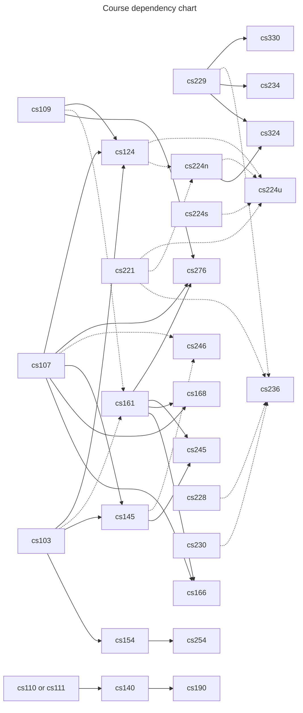

- 13-10-2022: created

- More info:
	- Visit: https://explorecourses.stanford.edu/search?view=catalog&filter-coursestatus-Active=on&page=0&catalog=&academicYear=20172018&q=cs276&collapse=

cs103 Mathematical Foundations of Computing
[[cs106x programming abstractions in c++]]
cs107 Computer Organization and Systems
cs109 Probability
cs110 Principles of Computer Systems
cs111  Operating Systems Principles
cs124 From Languages to Information
cs140 Operating Systems and Systems Programming
cs145 Data Management and Data Systems
cs154 Introduction to the Theory of Computation
cs161 Algorithms
cs166 Data Structures
cs168 The Modern Algorithmic Toolbox
cs190 Software Design Studio
cs221 Artificial Intelligence: Principles and Techniques
cs224n Natural Language Processing with Deep Learning
cs224s Spoken Language Processing
cs224u Natural Language Understanding
cs228 Probabilistic Graphical Models: Principles and Techniques
cs229 Machine Learning
cs234 Reinforcement learning
cs236 Deep Generative Models
cs245 Principles of Data-Intensive Systems
cs246 Mining Massive Data Sets
cs254 Computational Complexity
cs276 Information Retrieval and Web Search
cs324 large language models
cs329s Machine learning systems design
cs330 Deep Multi-task and Meta Learning

---

-17-8-2022:
	- Stanford AI track: NLP courses
		- Change this url's last tag with the course ID to get the link to the course: 
			- https://web.stanford.edu/class/cs224u/
		- [[(Course) cs124 from language to information]]
			- Source (book): http://web.stanford.edu/~jurafsky/slp3/
		- [[(Course) CS224N Natural Language Processing with Deep Learning]]
			- Good notes included.
		- CS224S: Spoken (audio) Language Processing
		- CS224U: Natural Language Understanding
		- [[(Course) CS224W - Machine learning with graphs (stanford)]]
		- CS276: Information Retrieval and Web Search
		- CS221: Artificial Intelligence: Principles and Techniques
		- CS230: Deep learning
	- Stanford "Stanford Engineering Everywhere (SEE)" courses
		- Source: https://see.stanford.edu/Course
		- CS106A Programming methodology
		- CS106B Programming abstractions
		- CS107 Programming paradigms
		- CS223A Introduction to robotics
		- [[(Course) CS229 Machine learning]]

