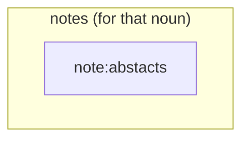

### The final integrated version is in the bottom of this page!!

- 9-11-2022:

![[Pasted image 20221109081021.png]]
- Keyword inspector from youtube vidIQ tool.

- 7-11-2022:
	- Two online (not all are free of charge) citation network 
		- Connected papers: https://www.connectedpapers.com/main/355b86dafd852e4df905f6ad9402c7d03831d618/Probabilistic-Latent-Semantic-Analysis/graph
		- Local citation network: https://timwoelfle.github.io/Local-Citation-Network/

- 19-10-2022:
	- The basic structure of the knowledge graph.
		- 1. RDF is computationally inefficient and not the way how human work on knowledge. Use meta-relationship instead.
		- 2. Tag entities with various types. 

- 18-10-2022:
	- Look at VSCode-Intellicode: "derive from 4855 examples from Github"

![[Pasted image 20221018134716.png]]

- 16-10-2022:
	- Check and balance: 
		- If there is a knowledge graph that trying to dual-convert a set of notes for entities, then there should be a "check and balance" mechanism that equally fills in same information for all parties that are mentioned in the same sentence. 
			- eg: "The problem of mapping from a string of words to its [[parse tree]], which contains [[context-free grammar]] and [[lexicon]] is called [[Constituency parsing]]."
			- There are more than two entities in this sentence.
			- If we want to distill the knowledge of this sentence towards these four individual notes, then we have to somehow repeat the same sentence N times such that each notes are self-contained. 

- 9-10-2022:
	- $x^{(i)} \in R^{100}$ might be we can spread a lot of those dimension into "folder".  such that the calculation would be much faster. 

- -7-10-2022:
	- If we are talking about the schema of the [[knowledge graph]], that is out of the responsibility of how a GNNs works. GNNs consume [[knowledge graph]]s and the structure of the [[graph]] creates [[path dependence]] of how the program should solve the problem. The design of knowledge graph should be more of a [[problem space]] set of problem? 

- 6-10-2022:
	- Echoing [[category theory|category theory]], there should be some "parsing" method for human to read a article such that they can understand the text much more effective than computer. 

- 5-10-2022:
	- Split: 
		- Entity database --- store everything in the grqaph
		- Entity brain --- each nodes random sampling ~100 connected evidences to construct the brain. 
		- Several brains train themselves 

- In the setting of 'fact / function / attributes / problem patterns / implementation'
	- 14. Subset superset relations could only would be found that are on the same folder.

- 2-10-2022:
	- Index page / superconnector of a group of object, is actually very similar, or equivalent to datatype of 
	- If we "reduce the matrix dimension" (instead of using hetreogeneous graph, we can use a simple graph + attach the "type" with "association" edge to the object nodes.)
	- The intuition is, convert the heterogeneous graph closer to homogeneous graph. 
		- 1. most knowledge graphs are heterogeneous graphs, they tries to create many kinds of edge for the graph, and GNN are weak at handling that many kinds of edge type. Knowledge graphs become expensive. 
		- 2. And I consider nodes are the object that stacks up information, edges are not a good location to store location. 

- The draft of the structure could be:
	- Motivation:
		- Wants to make the model to be more computational efficient, and to be more self-supervised by extracting more "features" from the corpus (i.e. make use of the paper / library / argument structure of the corpus, which would be discussed in the next session)
	- Assumption: 
		- in the graph, all node type / edge type also become a node in the graph, 
	 " but we don't show it in the visualization. " (i.e. implicit nodes) thus the node type and edge type become trainable. 
	- Embeddings <-- type 
	- Each node has a chance to be 

- There are some path dependence effect how races develop the 
	- Many NLP models are from Korean and Chinese researchers, inspired by the grammer structure of Chinese and Korean words. 

- Research direction
	- Topic analysis (document level / sentence level sub sentence level)
	- CNN for sentence classification (that is a paper)
	- 

---

- Steps of using this value, my experience
	- Document zone 
		- 1. Gather a lot of papers from internet, and then create a note page as a container for each of them
		- 2. Write notes in each containers 
		- 3. Find new concepts and then create a atomic notes for each concept, and then in the atomical concept notes, refer back its property to each papers notes.
	- Atomic note zone
		- 1. Gather ideas from documents

- Dimensionality of information
	- Library ( = a set of books, papers")
	- Paper  ( = a set of reasonings. with a categorization of "Subject / theme")
	- Reasonings ( = a set of relations and entities pairs / proposition + implications, with a categorization of "Arguments / Lemma")
	- Relations and entities ( = a set of nodes, with a categorization of "node type" + a set of links, with a categorization of "link type")
		- Metadata (eg: author, date) co-exists with the smallest entities-relation pairs. 

---

- 1-10-2022:
	- Non-planer notes:
		- Interface

- 30-9-2022: 
	- There would be a lot of time people chosen a much long step to explain some concept that could be expressed by 1~ 2 words
- eg: discuss "why identity law is needed for defining morphisms"
![[Pasted image 20220930033631.png]]
![[Pasted image 20220930033714.png]]

- Completeness of each description for the entity
	- Rarely finds one author would provide a serious full description for one entity. (Gödel's incompleteness theorems -- that is impossible to give a complete picture of something.)

- 28-9-2022: 
	- Let's say we preprocess the article to be a long text of RDF. The knowledge representation of RDF triple could not be fully mapping back to the original article. That means the loss of information is huge.  
	- --> We need to design a way of knowledge representation such that those features could be retained. 

- Big O notation for time complexity etc: The more cruial parameter should be how much time required to increase the graph size from N to N+1. But not the time for the graph from 0 to N+1.

- 26-9-2022:
	- From Foundation model: The future of machine learning is to decompose tasks. So for my project, the goal should be solely focus on how to produce an effective search space that another algorithm could collaborate, eg: reasoning using the graph structure that I made. 

	- Foundational model = Self-supervision, How to construct a co-occurence matrix collection method so that the ML model could efficiently collect data, without much human engineeering. 

- There are two kinds of mapping: One is internalism -- map the inputs to the mening or internal object. One is referentialism -- map from a word ao an externel referent, or a situation to a truth value.

- 24-9-2022:
	- The principle of manually creates a maintainable and scalable non-planar knowledge space
		- The process of modulating a collection of corpus can be think as a non-bijective and non-surjective process: 
			1. A collection of corpus $X$, just copy and paste all of those mentioned articles in a folder --> the volume of the texts is only thing we need to care about in this step. $\forall x \in X$ 
			2. Mark up important concepts inside the corpus  --> Those concepts will be our "named entity" and will be shown in the graph. 
			3. Open another folder, and create a page for each "named entity". 

- 22-9-2022:
	- Choice of including the detail of a knowledge into the article. 
		- The additional of information leads the reader to connect with more area of their memory. The probability of the reader , which adds the believability of an article. 

- The necessity of having a higher level layer of "abstract" knowledge graph that handling reasoning --- the "full" knowledge graphs has huge dimensionality that make the cost of computation very costly. Which is not how human process information. 

---

- Content
- 0 Gradual transition of information processing technology and also how the volume of information is growing in human society
- 1 Wayfinding, BFS/DFS and quantifying what is a fast knowledge gathering process
- 2 Knowledge technology, GNNs, Knowledge graphs algorithms, and their limitations. 
- 3 Assumptions about knowledge units, and characteristics for a good knowledge representation
- 4 My proposing knowledge structure and the unexplored zones 

- Framing the article:
- 0 Gradual transition of information processing technology and also how the volume of information is growing in human society
	- Most people are running greedy algorithm to search for suboptimal source of information. Current internet searching are text based, so search engines runs poorly beyond factual information.  (Refer to 2-9-2022)
	- Introduce the gradual transition of information processing, eg: the emergent of search engines, note taking applications, to make the content of the paper to be more relevant. (Section 0). Introduce what qualities have improved: (a) readability (by hiding what the reader alright know), (b) expressive power (that each concepts are now coordinated with a set of relevant concept, (c) The cognitive challenges for authors -- create the most impactful articles with the least amount of time creating  duplicated content, readers --  want to get the information as effective as possible. (Section 0)
	- Currently there is no popular tools of such thing that is helping humans to escape from these patterns. That tool is what we need. Define the interest of this paper: Obtain a structured data format that enable synthesis of knowledge from a set of articles. And then produce back a more fluent article to human and machine. 
	- The recent trend of the use of advance note taking applications could provide a suitable environment to collect massive data stream for developing the next generation note taking application. 
- 1 Knowledge representation, Wayfinding, BFS/DFS and quantifying what is a fast knowledge gathering process
	- Knowledge representation = the convertiability of an article to be a graph. And vice versa. Two author might conveying the same graph of knowledge, but with different dialects. 
	- Three level of structuring: (a) Natural language, (b) data (no logic), (c) graphs or models that enable reasonings between labelled data (Refer to 29-7-2022 Excerpt of my whatsapp to Poon.)
	- Before that, I need to introduce a way that enable us to quantify such speed of navigation. (Section 1) and also introduce what is non-planar information, and describe why most of the information out there are planar information, and how the transformation of non-planar information would helps. (Section 1). Introduce a few of concepts model that I found (Section 1)
- 2 Knowledge technology, GNNs, Knowledge graphs algorithms, and their limitations. 
	- Also, such transformation have to interactable with current technology. So I need to introduce what is neural network, what is graph representation and introduce GNNs and also a few of popular algorithm that works with knowledge graphs. (Section 2)
	- NLP preprocessing: deleting the chunk parts, entity recognition, extracting the RDF etc. 
	- NLP: sentence type tagging: declarative, exclamatory, imperative, interrogatory. Levels of of NLP problems: (a) lexical comprehension (word vector), (b) literal comprehension (semantic transform + knowledge graph), (c) interpretive comprehension (understand facts that are not explicitly stated.) (d)  Applied comprehension, relate story to existing knowledge or opinion, (e) Affective comprehension: Understand social and emotional aspect. (Refers to 30-8-2022). 
	- Mini-batch processing, stochastic gradient descent, massive collaboration. 
	- The process of preparing a knowledge graph -- entity recognition, edge embeddings , labels, constructing knowledge graphs. (Refer to 15-9-2022)
- 3 Assumptions about knowledge units, and characteristics for a good knowledge representation
	- Knowledge is incompressible
		- Inductive training leads to [[Loss of information]]. 
	- Meaning of a concept is determined by its connection to other concept
	- The effort in structuring and ordering that inhabits knowledge improves the reusability of a concept, which is more effective than looking for a new random unstructured article. 
	- Planar knowledge representation, by its own definition, usually failed to deliver fluent communication to readers. And most of the articles are planar. 
	- The "difficulty" label for a sentence is an important label for universal documentation handling. And the difficulty would be related to concept dependency tree. 
- 4 My proposing knowledge structure and the unexplored zones 
	- Side talk: The curse of "3 years": All university majors can be completed within the same time period. That is because we human could hiding details underneath the application level.  
	- Quality pursuing: (a) "to be able to recursively provide the most similar explanation of that word", "Sorting out the concept dependency tree and then the software is able to generate back an article with a random chosen dialect." (Refer to 25-8-2022). 
	- Strategy of the algorithm: (a) Pre-processing, by categorizing the content, and breaking down composite sentences into multiple shorter simple sentence (b) Search for some ways that could sort out easy sentence, by the length of the sentence, and the using frequency of a word. (c) Providing a difficulty score for a sentence corpus after sorting (d) Decode the O-O-O or RDF triple for all sentences, all articles.  (Refer to 24-8-2022)
	- Introduce a structure that speed up the navigation of information. (Section 4)
		- a. Interface that contain at least one argument (That assigns and lead the attention of an article.)
		- b. Net of abstract concept that finish the argument of the interface
		- c. The most common, RDF knowledge graph that serves best for factual data queries.
		- d. The interaction structure of b and c. how a knowledge community (eg: the knowledge cloud for a field, let say, GNN, could have multiple interfaces).
	- The future of learning and researching: It is not going to be book by book, article by article. It would be a series of mini-notes linking together. And each mini-note is a community in a knowledge graph. The role of human author would be filling up certain missing links with his own dialect with the neighbor knowledge chucks. With a dialect machine + a subset of knowledge graph, it is possible to generate back the book that is written by the writer. 
- 5. How a single document, after such transformation, could pours into the knowledge database with such data format. 
	- (a) Document level graph: Compare and cluster similar document together. Sort out the similar document first. 
	- (b) Concept level: Sort out concepts from "facet data" 
	- (c) The most underground data would be graph database the adapt RDF and trying to effectively store data of different entities. 
- 6. Possible mention
	- (a) Applying the Gaussian Elimination techniques in reducing the complexity of a knowledge graph structure. 
	- (b) Similar to page rank (google algorithm), Reduce the required depth by ordering the "difficulty" of one node (What is the drawback?)
	- (c) RDF could be a suboptimal option for keeping conceptual knowledge. 
	- (d) Now computer can handle nearly all tasks that a book that is available in a bookstore. History book (factual data) --> (graph) database. Language books --> NLP. Scientific concepts --> The last piece of puzzle to solve. 

 
 - Reference: 
	 - Paper: Deep Learning-Based Knowledge Graph Generation for COVID-19 "Sustainability" journal. 
---

- 21-9-2022:
- Attention and sub-layer: 
	- Different than NLP tasks, the attention for the reader is differ based on their use cases. 
	- Given: Transductive reasoning is better than inductive reasoning. Transductive attention is also better than inductive attention, for NLP, the transductive part is not significant, but for knowledge graphs, the transductive part is very significant.

- 20-9-2022:
	- The possibility of multiple "interface" of knowledge that capture N kinds of community for a domain. eg: For the domain of GNNs, there are multiple way of classifying the content. 

- Introduction: 
	- 1. Data mining = Oil mining, and algorithm and artificial intelligence is the electricity that speed up how we obtain them. Most valuable companies are handling information for people.
	- 2. Duplication of people contribution on sub-optimal knowledge structure. That leads to non-scalable learning and teaching that people have to pay a huge cost to repeatedly doing it. 
	- 3. Graphs are the most expressible of ways to deliver meaning, which has the least cost of decoding the meaning, and the least ratio of irrelevant information participates the communication
		 - a. It improves the readability if an article would associate with such knowledge graph aside it. 
		 - b. It improves expressive power by associating relevant information in the dots that you are concerning. 
	 - 4. The cognitive challenge for humans
		 - a. For authors, they want to create the most impactful articles 
		 - b. For business 
		 - c. For readers, they want to get the sense of they are concerning as effective as possible. 

- Side dish:
	- Knowledge (Rc) model for knowledge by Wang
	- Wayfinding algorithm by Jure
	- Zet. Notes taking styles and the value of atomic notes taking 

- 19-9-2022:
	- Personalized non-planar expression for knowledge containment 
	- How textual knowledge can be represented by a knowledge graph.
	- My assumption: 
		- 1. Knowledge is incompressible
			- While teachers and learners are all trying to perform compression of knowledge to make the concepts are easier to navigate, they are failed to maintain the completeness of the meaning. 
			- Any trials of "Information compression", only good for the author himself to feel good about himself, but not for the reader. To fill up the loss of information, either it requires a reader to fully understand a concept, they either have sufficient background knowledge that are related to the field/concept, or they need to read external material that fills up the shaded area that loss of information caused by such "compression" activity. 
		- 2. Connections are the only useful description for a concept. 
			- In linguistic, meaning of words is defined by the surrounding words. In cognitive, The meaning of a concept should be defined by the nearby surrounding connected concepts.
			- 10 different book authors can describe the same concept in different way, but if we convert all of those expression into graph, they are pretty much the same, except the edge they are using is slightly different. 
		- 3. Ordering of information is more important than the quantity of information
			- The way of improving understanding is about providing orders to the known facts. 
		- 4. Planer knowledge expression is always the most fluent way for a person to express himself, but not for the reader. 
		- 5. The volume of knowledge is determined by the connections between concepts. 
			- The only way of expansion of knowledge boundary is by 1. Adding virtual edges 2. Finding connections between 2 nodes. 
	- A good notes should have the following quantity:
		- 1. Universally understandable
			- Not tailormade for a specific individual but all range of audience could reach a certain level of understanding after reading it. 

- Research directions + show how possible they can be achieved: 
	- 1. Verify whether knowledge are incompressible
	- 2. Length as an indicator of how deep a the concept level of the graph representation of the article. 
		- Related: Scale free network properties
	- 3. How Graph neural network could have a better representation for knowledge acquisition.
		- (a): How to decode the RDF-like structure from the natural language texts. 
		- (b): How to have a better structure for representing a knowledge network.
	- 4. Human-interacting graph neural network 
		- Stochastic gradient descent, mini-batching, massive collaboration 

- Show off the programming skills in Machine learning in the paper
	- 1. 
	- 2. 
	- 3. 
	- 4. 

---

- 18-9-2022:

- Strategy of being a good developer:  
	- create an environment that has the least cost of scaling up the workflow  
  
- Learning:  
	-  it is always a sequential process, add/remove dots that changes your understanding, and the new understand + delta change that tries to improve the understanding and thus move the dots.

- 17-9-2022:
	- Data storing graph and knowledge connection graph should be separated in two different graph (sub graphs) , but two graphs are linked by a special kind of edge. 

- Layered knowledge graph structure 
	- 1. Search "hierarchical graph representation learning" 
	- 2. Embrace the "general-abstract" layered thinking, which speeds up the time of "understanding" an article. "Understanding", in my definition, it means having enough time for the reader to gather sufficient data to make sense to the article they are rading. 

- Proposing a kind of hierarchiel structure:
	- 1. Document level graph: Compare and cluster similar document together. Sort out the similar document first. 
	- 2. Concept level: Sort out concepts from "facet data" 
	- 3. The most underground data would be graph database the adapt RDF and trying to effectively store data of different entities. 

- The curse of "3 years": All university majors can be completed within the same time period. That is because we human could hiding details underneath the application level. 

- All "concepts" are forced to search for one document / one domain and also some cluster of supporting evidence. 

- 16-9-2022:
	- GCN versus human learning:
		- Human would interacts with the pool of content and reduce the excess information. (Forgot gate), and reduce the size of knowledge graph to speed up the recognition. Is that an effective way to improve it?

- Applying the Gaussian Elimination techniques in reducing the complexity of a knowledge graph structure. 
	- Instead of Gaussian elimination, eigenvector approach like $\lambda c = Ac$ (slide 242 in cs224w) could solve the question more efficiently.

- Reduce the required depth by ordering the "difficulty" of one node (What is the drawback?)

- 15-9-2022:
	- Stage 0: Entity recognition
	- Stage 1: Edge embeddings that highlights 
		- Semantic meaning of a word depends on its neighbors. Applicable meaning of a concept in most of the case could not be fully described within one sentence. 
		- Labelling the corpus with "What kind of relationship the sentence is conveying". That generates edge embeddings. Edge embeddings predicts that sentence is whether descriptive, explanatory or just commentary, emotional etc. 
		- By aggregating "A relationship B"
	- Stage 2: Node embeddings that predict the labels of a concept node. 
	- Stage 3: Construct knowledge graphs for different batches, mix and match knowledge graphs from different authors, generate a better knowledge graph and then generate a better articles that provide explanations to human and machine readers. 

- Graph level prediction: 
	- More high level concepts are stacking up from lower level concepts. 
	- Predict the difficulty of understanding an arbitrary article, based on how many prerequisite "education" required. 

- Four color theorem and pressing down the feature labels to 4?
	- In node label visualization, we use color to distinguish different types of nodes. Is 4 color theorem also applicable to labels (for ML)?

- Knowledge graphs should be multigraph. (which means there could be more than 1 relation between 2 entities.)

- The concepts distance evolves over time and relevant information are locating closer. 

![[Pasted image 20220915170754.png]]
- Figure: from W2 of cs224w

- Put two graphs that are relating to similar topic in parallel, can one graph guide another graph to reconstruct itself?

---

- 2-9-2022:
	- Most people in most of time are running by greedy algorithm: they make their choice that looks best at the moment. Querying on the internet won't gives you any meaningful contents. Currently there is no technology that is helping humans to escape these kind of patterns.  A map is what we need. 

- 1-9-2022:
	- First stage: academics are the first group of people to promote this tool. 
	- Especially highly cited paper research areas, like machine learning
		- Make reading groups and allow people to add their notes right after each academic paper. 
	- Invite some of them to create an account to create content. 

- 31-8-2022:
	- The difficulty of Knowledge extraction from NLP is that, lexical meaning could be found by neighbor words, but in most of the case, you have to use another sentence to explain the conceptual meaning of a concept. 

- 30-8-2022:
	- 4 types of sentences 
		- Declarative: statements, facts, offers explanation, coveys information.
		- Exclamatory: with strong emotion
		- Imperative: Expresses a command, request, invitation, warning or instruction.
		- Interrogatory: A sentence that ask questions
	- NLP in the long term should be able to create solutions for all different levels of question answering problems:
		- 1. Lexical comprehension: Understand key vocabulary in the text
			- NLP: word vectors (interpret word meanings by the co-occurrence matrix its adjacent words)
		- 2. Literal comprehension: Answer factoid (who, what, when, and where) questions
			- NLP: semantic transform + knowledge graph
		- 3. Interpretive comprehension: Understand facts that are not explicitly stated in the story. eg: What if, why and how questions.
			- NLP: 
		- 4. Applied comprehension: relate story to existing knowledge or opinion
		- 5. Affective comprehension: understand social and emotional aspects

- 29-8-2022:
	- Word embeddings are derived from "neighbor words" in all text corpus. All word vectors / embeddings for all words are just containing its own meaning. 

- 25-8-2022:
	- The input sentence should be able to classify entities out of the sentence (for a specify kind of learning) so that the focus of learning?
	- eg: a complex sentence: `If you are using L2 regularization, that would tend to shrink the value of $W^{[l+2]}$. And let's say for the sake of argument that B is also equal to zero, then $a^{[l+2]}==a^{[l]}$.`
	- The product should be: "able to recursively provide the most similar explanation of that word". Sorting out the concept dependency tree and then the software is able to generate back an article with a random chosen dialect. 
- 24-8-2022:
	- The strategy of the software should be:
		- 1. Search for some ways that could sort out easy sentences 
			- eg: the length of the sentence
			- eg: the using frequency of a word
		- 2. Providing a difficulty score for sentence corpus after sorting. 
		- 3. Doing a list of preprocessing
			- Categorization of context
			- Breakdown composite sentences into multiple shorter simple sentence
		- 3. sequentially decode the O-O-O relationships for all documents. 

- Reference: 
	- Paper: Deep Learning-Based Knowledge Graph Generation for COVID-19 "Sustainability" journal. 

- 23-8-2022:
	- The future of knowledge medium is not going to be "book by book", "article by article" anymore. It would be a series of chuck linking together as a knowledge graphs. The role of the book author would be giving a proper dialect over that set of knowledge chucks.  
		- a. With a dialect machine + a subset of knowledge chuck network, it is possible to generate back the book that is written by every writer. 
		- b. With the extracted knowledge chuck network, It is easier for computer to fusion the knowledge with another papers / books so that machine-aided knowledge fusion become possible. 
		- c. For human reader, writers, it is exponentially faster for them to understand a chuck of knowledge if the size is small.
		- d. If we separate the information out of the writer's dialect, the cost / risk of generating reductant new webpages / books / papers that creates overload information will be decreasing. 

- The number of training sample is the most crucial factors for the accuracy of the system. While internet articles are written by human writers at the very beginning, Very few researchers are going to create a ecosystem that attracts human writers to inputs. 

- 21-8-2022:
	- other than RDF: 
		- Inspired by Chinese language, and also the actual application of objects / concepts, "3Os" chain is a plausible options to frame something. 

- Trade of between "Ambiguity of language" versus "The effective structure of a knowledge network": The 

- 20-8-2022:
	- JSON, XML etc: How web applications communicates with each others. 
		- The similarity of Zettelkasten and JSON files. 
	- Some complexity theories
	- Massive documents --> Zettelkasten --> Graph neural network
		- Expected effect: 
			- 1. Establish a bridging space that stores organized information that would ultimately reduce the feature dimension of the knowledge graph. 
			- 2. Establish a possible way for humans to interact with the knowledge graph. 

- Questioning: Is RDF triple the most effective way to construct Knowledge graph?
	- My interpretation: 
		- 1. Morphosis of part of speech is not uncommon in natural language. This is especially common in Chinese language. 
			- a. An object could be a relation. 
				- (老吾老以及人之老, 第一個老字: 借字)
			- b. A relation could be an object.  
			- c. In general case, the same text could be used as different parts of speech.
				- 跳: could be noun, could be verb. 
		- 2. Interactions is more than relational. 
			- a. Reproductive 
			- b. Actions-reactions pair
	- My proposal: 
		- "Object-Object-Object" model replacing RDF triples. 

- Go to read Child book to get aspiration of how human beings learn the outside world with very little acquired knowledges

- 19-8-2022:

- Drawing: linked webpage versus linked DBpedia
	- ![[Pasted image 20220820220809.png]]

- GNN equations: (source: [[(Course) CS224W - Machine learning with graphs (stanford)#^a83756]])
	- 1. Node embedding: $H^{(k+1)}= \sigma(\tilde AH^{(k)}W^{(k+1)})$
	- 2. Message passing in a very generic form: $h_u^{(k+1)}=UPDATE^{(k)}(h_u^{(k)},AGGREGATE^{(k)}(\{h_v^{(k)}, \forall v \in N(n)\})$, where h is node features / embeddings, k is the number of hops.
	- 3. "self-supervised" process: $h_u^{(k+1)} = \sigma(W_{self}^{(k+1)}h_u^{k}+W_{neigh}^{(k+1)}\sum_{v \in N(u)}h_v^{(k)})$
- The word embeddings is referring to "self" and "neigh". Could the knowledge graphs also consider W3 = W of "common senses", so transfer learning could be easier?

- 18-8-2022:
	- The problem of hierarchy clustering: should we allow jumping between branches? If it is not allowed, then it might lead to another searching problem. 

- 17-8-2022:
	- Intuition: 
		- Intuitively, computer can complete all tasks that human need to think for a very long time. Human brain could recognize the same thing much more efficient. That might indicates the current machine learning algorithm is not optimized. 
	- There is still no real useful application of knowledge graph is being produced by today. 
	- Representing a graph for machine learning task, it would produces a m x n matrix. The bigger the matrix, much more computation is needed. If the understanding of the graph can be decomposed to multiple degree, the size 

- The main factor to decide the quality of decisions:
	- 1. Providing a quality standard to the agent. It is supported by the fact that computer is improving its behavior by forward and backward propagation. 

- 16-8-2022:
	- Knowledge graphs is a subclass of datagraph. Datagraphs are including: {event graphs, computer network graphs, disease pathways graphs, food web, particle networks,social networks, communication networks, citation networks, neurons networks, code graphs.... }

- Two main problems that are closely related to:
	- 1. The interplay between the topical relatedness of concepts and the underlying network structure. 
	- 2. The strategies used by efficient information seekers.

- The new prototype is, the software will have 3 sections:
	- Section 1: human writers input atomic notes into the machine
	- Section 2: Human submits what they want to accomplish, and then machine generates human readable contents that fits the need of the reader. 
	- Section 3: To speed up the reading, a proper graphical structure will adjacent the text that navigate the reader. 

- 15-8-2022:
	- Entity-relationship model is a very powerful solution for certain kind of business problem: 
		- 1. The returning values of the entities are the most concerning for the database operator. 
		- 2. Changing the schema of a database would be very costly because referencial keys of the existing data are already determined. 
		- 3. To generate something, coder have to design a "schema" before using it. 
	- Clearly, we still consumes took a lot of time to search for the data we need to construct the network of knowledge, then to learn something. 

- But It would heavily cooperate with existing ER models or schema-free / NoSQL models, because the software expects to intake a lot of data. 

- Dependency between concepts to understand a topic. To understand a topic, people would search for a "book" to learn it. Computer scientists call them "unstructured data"

- Semantic web: a solution?

- AI still cannot replace content writer 
	- With the current technology, there is no computers could construct abstract understanding about the world. 

- Notebrain will not be a database!! 
	- Database exists for 50 years and the paradigm of sharing knowledge still "book / sheet" like structure. 
	- Databases are designed to answer the questions that returns concrete values, given that it has a concrete schema. But database is not designed to answers the question about the schema and more abstract connections between entities. 

- Technology required: A technology that could forms up abstract understanding automatically. That could helps both human users to grasp the [[problem space]] effectively, and also allow computer to form up 

---

- 6-8-2022:
	- "Agent based" self-forming network, instead of top-down approach of forming a network. 
		- Most of the networks are self-formed following their rules, such as Telecom networks, social networks etc. 
	- "Policy" function: 
		- Within a domain, we can assign a "gravity field" that eventually change the emergent effect of the graph. 
	- "Weight" of connection in the global graph:
		- There is no logic processors, but it relies on how many users are connecting two vertices. One user cannot add multiple weight on one edge. 
		- The system aggregates all activities and then forms the graphs. 

- 27-7-2022:
	- Observe how 

- 20-7-2022:
	- All kinds of knowledge, after all, can be divided into 3 parts. 
		- 1. Connected factual data, 
		- 2. Models and concepts (and dependency relationship between them)
		- 3. Training set problems (eg: 1000 examples of applying some concept / words / )
	- And in the last 50 years we have built 
		- a. Connected factual data --> Database, hypertext webpages, 
		- b. Models and concepts --> Software engineering 
		- c. Training set problems --> Machine learning (Pass through 10^6 + examples into a chain of regression unit to memorize a pattern)

- 18-7-2022:

- Common space
	- Constraint of each entity: Should be a noun / or importing from wikidata (wikipedia threads)
	- There will be an algorithm that we keep feeding articles into it, and then it would extracts hierarchical knowledge representation.
	- Then, that's say 2 independent computers feed articles by themselves, and then we merge the pool of knowledge from these two computers, it has a way of resolving those connection problems. 

- User experience
	- There will be an / extension or a plugin in the side of the browser 
	- The user click "start" to begin search for the thing they are interested to look at. 
	- The extension keep feeds html documents into the extension. 
	- The extension analyze the text network and then have a guess on what are the user is interesting on. 
 
 - 15-7-2022:

	- Bookstore: 3 kinds of books. 
		- Language books: they are more focus on the training set. 
		- History books: they are more focus on the factual maters. 
		- Problem landscape books (psychology, business, science, education).. : They are more focus on the relationship between information. 

- Algorithms and problem solving skills are much independent from the other remaining parts of the "knowledge" tree.

- 13-7-2022:
	- The eventual common knowledge space would be either:
		- The snapshot of the problem landscape, or
		- The ultimate meaningful questions generator for researcher

- Turing completeness
	- Turing machine: 
		- Turing was working on a problem of formal logic, and as part of his proof he had to come up with the notion of any possible algorithm or any possible machine. He had to come up with a very general way of capturing how algorithms or programs or machines would work. 
		- You have a way of writing down information in a coded form. 
		- Thinking of a tape, which is as long as it needs to be. It is divided up into squares and each of the squares is either 1 or 0 or spaces. 
		- The machine looks at the tape. One square at a time. eg: a box on the top of the tape looking at one square at a time.
		- In particular time, there is  in a particular state, and it is looking at one square on the tape. And it has a logbook. That tells it, if you are in state 23, looking at 0, then rub out the zero. Change to 1. Move to the right, then go to grid 369.... Really simple instruction. 
		- Eventually, the machine goes to halting state, the tape is the solution. 
	- Any possible algorithm 
	- Evaluate the strength of modern computer program
		- When a computer can do what a Turing machine can do, we call it Turing complete. That is the top of the hierarchy of program strength. 
	- Quantum computing
		- It can't do more than Turing machine, but it can do more efficiently. 
		- Ask a classical computer to find you a phone number, in the phone directory, you have to look for every single entry and it takes a long time. 

- Computability theory:
	- A system of data-manipulation rules is Turing-complete if it can be used to stimulate any Turing machine.

- 12-7-2022:
	- The notes would be used in 3 kinds of scenario:
		- Common spaces (like wikipedia, everyone can use it)
		- Company / group working space (A company can slowly aggregate the knowledge base for internal use)
		- Personal working space

- In the most ideal case, in the personal notes, the user should only spend their time writing "dialect" explanation. All factual data, relationship between data, information, relationship between information, should be taken away and be stored in the common space, to reduce the repeated writing. 

- 11-7- 2022:
	- Comparing the similarity of 2 vault using the techniques in chemoinformatics

	- What Google Knowledge Graph can't do:
		- Generalize the reasons why something is trending. We need a top-down approach to look at the data. 
			- eg: emergence of new technology (computer) in early nineties, some research trend has grow.

- 10-7-2022: 

- Evolution of web of information: 
	- 1. Web of documents: 
		- The problem before WWW was that is very expensive to establish connection to arbitrary users. Hyperlinked texts allows computer user to discover other people's articles by using crawler. The main application is to allow people can work together in the forms of textual documents.
	- 2. [[Web of data, or semantic web, or linked data, or knowledge graph]] : 

- 3. Structured semantic web (my proposal): 
		- The problem now we have is, unstructured semantic web has no one can extract meaning from the semantic web itself. The action of querying data out of semantic web, requires the users to have sufficient knowledgeable on that field. No one can guarantee they are knowledgeable in any fields of the reading materials they are reading at. Most of the case, the material contains the knowledge that we haven't explored yet. The main application of structured semantic web is enable users to obtain a knowledge landscape for their problem with only the related entities and grouped and presented in meaningful structure such that the reader can get some of the meaning from its shape. 

---
- Comparing the benefits from each stage:	
- 1. Web documents
- 2. Semantic web
	- Personalization;
- 3. Structured semantic web
	- (a) No prior knowledge are required for all fields of knowledge. Atomic-notes are now self-explained without a big effort from a reader to search for multiple sources to integrate the full picture of the problem landscape. 
	- (b) Each unit of notes would be more reusable. 
	- (c) Each person can now generate their own version of notes with the aid of the recommendation system from the knowledge commons
	- (d) Nurture the users to have an ability to identify and jump across different dimension of knowledge. 

---
- Relationships between entities --- In structured semantic web 1.0
	- I think, those complexities between entities could be reduced into a few number of meta-relationships. eg: machine learning would have only several basic "problem", and those additional problems are considered as the extension of those basic problem.

- Examples of relationships between entities:
	- The chunk:
		- 1. Fact --> Model --> Problem patterns --> Implementations 
	- The leafs:
		- 1. Parent/peer/child relationship (eg: physics-mechanics, and mechanics-electromagnetics)
		- 2. Abstract-concrete relationship (eg: fruit-apple)
		- 3. Components / Composition relationship (eg: human-hands)
		- 4. Dependency (The existence of entity A requires the entity B is completely introduced, or the technology of entity C requires the existence of technology D.) 

- Synthesis of new knowledge 
	- Emergence phenomenon in complexity theory: In philosophy, systems theory, science, and art, emergence occurs when an entity is observed to have properties its parts do not have on their own, properties or behaviors which emerge only when the parts interact in a wider whole.

---

- 
- Each user will have a personal vault for their personal use. 
- And in the central all users could access a common space, which everyone could edit, directly adopt the notes-unit from it. 
	- If a user link his own perceptron with the common space note-unit, it would have a 'subscription' function. If there is any update on that block, there would be a 'blue dot' market on the block. Just like when a youtube user subscribed a youtube channel.  

----

- Nowadays the dominant structure is 'dandelions'
![[Pasted image 20220709000422.png]]
- Figure: Dandelion

- The should be like perceptron
![[Pasted image 20220709000501.png]]
- Figure: Perception neural net

----
- Data harvesting 

- It will be an user-generated knowledge framework. It will be different from those "automatics" taxonomies / NLP programmings which reads human texts and generates the knowledge landscape. Instead, it it a common-ground that every users write under that framework. 

- Competitive analysis:
	- 1. NLP is not an effective medium for delivering knowledge. In the world of software engineering, all users have to follow the common rules so that the computer could understand ( --> Need an abstract term here) without noise.
		- We need to create a common format that foster the spread of knowledge. 

- Feature of notesbrain: view, build, share
	- 1. View --- Speeding up knowledge acquisition speed. It is attempting to be an independent information format that aims to speed up the knowledge acquisition. That will be achieved by the following: 
		- (a) Graphical mapping boosts the time consumption of reader to acquire the meaning of a text.  
			- It visual graphing linking each knowledge-object depicting the ontology of domain knowledge. Each knowledge-object itself contain a smaller size of text.
			- But it is not a mind map. In a big level, it establish hierarchial separation of "models" --> "problem-patterns" --> Implementation cases.  It is more looks like a relative of neural network. 
		- (b) Attributing each knowledge-object with hierachial tag, such that users could narrow down their information search with the tag. 
		- (c) Version over time chart on the second page? 
	- 2. Build --- It is an attainable technology 
		- Github: software modeling collaboration platform
		- Obsidian, notion, roam research: Personal semantic note-taking application that becomes popular in the recent years. 
		- MermaidJS, plantUML etc: A markup language that allow users to produce graphical networks from text. 
	- 3. Share --- Reducing the repeating studying hours of the crowd. 
		- Community: 
			- It will have a community feature that would be similar to github in the programming world that allows vault users to view, comment, clone, commit the knowledge models. 
		- Notesbrain backlink:
			- The website could produce a backlink that allows, lets say, a programming tutorial website, to click onthe backlink that open a notesbrained version of that webpage. 
		- Notesbrain browser extension:
			- An extension could be installed from the app market and then it would query the notesbrain database everytime the browsers go to the new page. If it found someone marked notes on that page, it would pops out message. 
		- data-analytics-retrieval-friendly format
			- Data science users could retrieval user created knowledge from such formated file.

- Feasibility: Could it be viral? 
	- 1. The existence of early adopters on note-taking app: 
		-  The user base of note-taking application like evernote, notion, obsidian, roam research 
	-  2. Migration cost:
		-  Migration cost will be cheap. 
			-  Collaborate with webpages: The system will be able to collaborate with the existing open sources hypertext webpage.  (See prototype)
			-  Collaborate with markdown files: There are a lot of users on the existing note-taking apps are familiar with how to use the markdown files + software to format their notes. They could contribute the early liquidity problem of the web app. 

- Webservice sustainability: 
	- Notion usiness model 

- Core idea: making use of the currently available note taking technology
	- 1. Hypertext --enables -->  Object-oriented note taking 
	- 2. Information hiding (programming concept) --enables--> 3D structure of a note.
		- In the traverse level, it is a (model -->concrete problem pattern --> concrete implementation ) setup. 
		- In the different of pratitioners, it is 

- Prototype: Hypertext + Notesbrain collaboration
![[Notesbrain - prototype 15 Jun 2022 - Copy.png]]

---
## Structure

#### Overall structure
- Facts --"Supports"--> "Model layers" --"Manifested by"--> Problem-patterns --"Become valuable by having"--> Implementation examples --> Alternated / improved facts.
	- The direction denotes the dependency of each element. 
	- This structure is also echoing with the way of how computers solving a problem. 
		- "Facts" is echoing with "database" systems in computer science. By now the biggest searching engine company Google is using graphical database to improve the searching result that they provides. The technique of looking for related facts that you concern is called "querying" information in CS. 
		- "Models" is echoing with "programming language" in computer science.
		- "Implementation examples" is echoing "machine learning" in computer science. The quality of the result is mainly determined by the number of examples we have, together with the "right or wrong" labels. 

#### "Facts" component
- Google knowledge graph did a good job on that. Names, timelines, 

#### "Model layers" component
- 1a. Note-edge structure, with the notion of 
![[Screenshot 2022-07-23 204736 - Copy.png]]
- Figure: The connectivity of a single note to the outside world. Horizontal connections denotes a "generalization-towards-concretion" relationship. That is like A is in the set of B, in set theory. The generalized one can fully explain its child. Inclined lines denotes "Leafs-and-roots" relationship. Many concepts are composed by or aggregated from multiple small concepts. 

- 1b. Each notes should be focus on describing the Noun of the note.  

- Figure: The inner structure of each notes

- Discussion of the component of (1):
	- 1a:
		- What are the "relationships"? -- The relationship could be "association", "contains"... etc (I have studied those relationship in All models)
		- In "models" part, the relationship are mainly composition, generalization etc. 
	- 1b:
		- Information relativeness of a note.
	- 1c:
		- The dialect from different users (which means the way of demonstrating a concept) is also going to be reduced. 
	- Discussion: Similarity between neural network and information net. 

![[Pasted image 20220728013208.png]]
- Coupling: the degree of interdependence between software modules. Low coupling considered as well-structured computer system.
- Cohesion:  High cohesion refers to the degree to which the elements inside a module belong together. 

- Principles of writing good notes:
	- Modularity: To build up some abstract ideas on the ground, the whole idea of all messages in the text should be about one object.  Then we could mark up knowledge by observing the interactions between those atomic level notes. 
	- Single responsibility: Each block should only has one functionality, and then we made a composite structure by making use multiple different elements. 
	- Liskov's substitution principle: Functionality of child class must contains all functionality of the parent class.
	- Interface segregation: Instead of having an over-generalized interface, split it into several smaller interfaces, in that way you will provide a more accurate description of the expected behavior of the object. 
	- Principle of demeter or least knowledge
	- Relational: 
	- Related to systems of objects
		- Recursively encapsulate information inside a sentence by reference. 
		- Principle of demeter / principle of least knowledge: 
			- An object should only talks to "closely related" units. The notion is that an object should assume as little as possible about the structure or properties of anything else. 
			- Violation of this principle would creates a lot of dependencies between objects, which builds up cohesion. 
