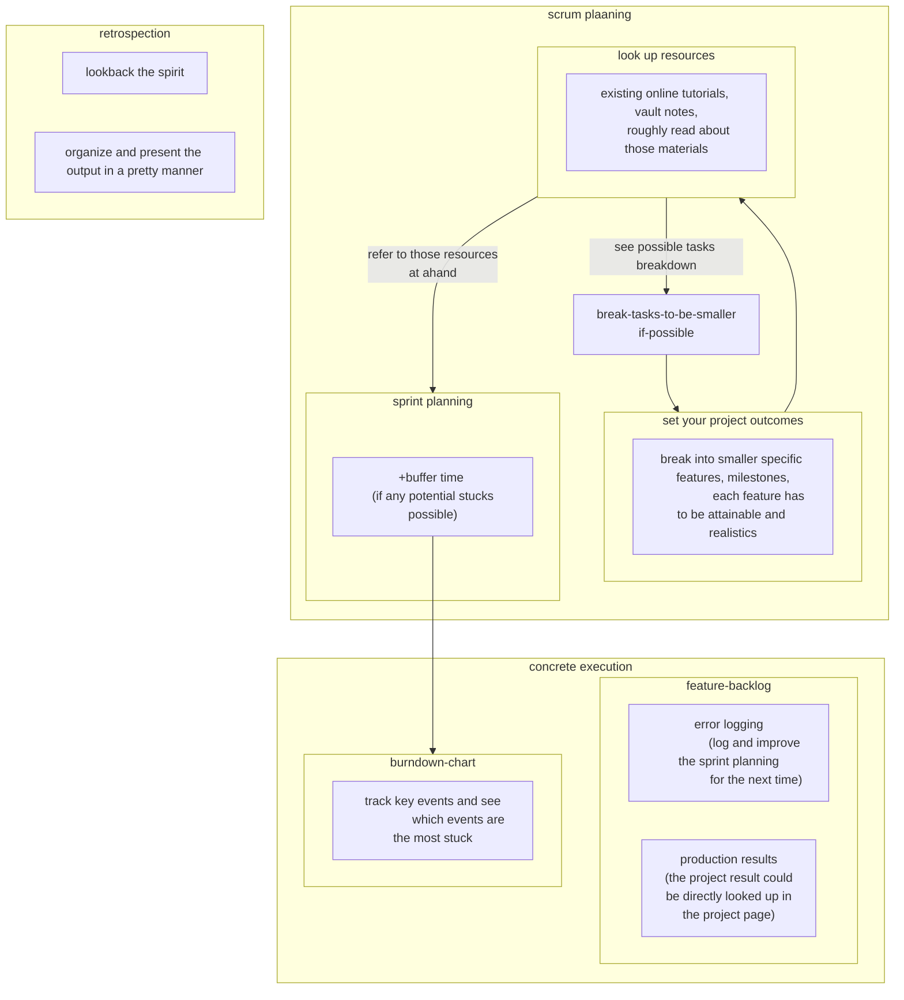

- Scrum created date: 21-12-2022

# Template frontmatter

- Created at csp vault in 6/6/2022.
- These scrum worksheet should be applied to "All projects". (Package theory, structural data theory of mine)
- A template of scrum project planning which could be a reusable framework to start and end a project. (Yes, it is located in the template folder)
- Each scrum should be an element of the collection of it. And there should be a page that could discover  the element of that collection, by the steps that better than "merely looking at the searching tab"

---

### Project objective
- 1. Discover the ways to develop an universal dependency tree from scratch.
- 2. Collect the information, including the workflow, the resource needed, and the skill needed. 
- 3. Find whether there is challenges / benchmark of the construction task of UD. 

### Study previous works

- Previous projects:
	- Does a collection of that project exist? If not, create one. If yes, go to that collection page and look at it. 
		- Yes. Implementation > All implementation > NLP
- Previous study: 
	- No. 

### Deliverable features list
- 1. Discover the workflow of making an universal dependency tree, Resource needed and the skill needed.
- 2. Tries to gather them if it could be reached within timebound. 

	
### Part 2:  Feature x N:  (One purpose only. Don't write any Product progress here!!)

- Guidelines: 
- 1. Copy / adopt the features list above.
- 2. Describe feature outcome in specific. 
	- Reduce the chance of scope creap
	- With specific outcome --> specific missing pieces --> discover more required resources before execution. 
- 3. Describe how to use resources to produce the outcome in detail
	- Reduce the chance of scope creap
	- Find the missing pieces or additional feature in the progress. 
- Try the best to order the feature list by dependency order, and the workers should work on feature in that sequence one-by-one.

- Feature 1: Discover the workflow of making an universal dependency tree, Resource needed and the skill needed.
	- Description: 
		- A list of steps will be obtained. I should remain a space to keep them. Consider that later. I can just temporarily paste those info here. 
		- The detail of the information should be more than enough for another user to look at it to kick start their job. 
		- It is attainable. Time bound is around 2 hours. 
	- Production backlog
		- Write the abstract activity sequence here. 

- Feature 2: Tries to gather them if it could be reached within timebound. 
	- Description:
		- Download and capture all resources, tools
		- I don't expect I can really create an UD today. 
		- Time bound is around 1 hour.

---
### Part 2b: Further atomization
- list steps of preparing each feature, to see whether each tasks could be separate into a new project. 
- To do that, we propose 3~5 concrete steps for each feature to see if each steps is simple or complicated. 
- If it is complex, break it down into smaller features.

---

### Part 3: Separable-timebound

- Copy the feature list to a google sheet which could creates a burndown chart. 
	- Estimate the hours in the google sheet to produce a chart: https://docs.google.com/spreadsheets/d/14lb8HPqtVQnLikdGOqW1QlMW9_jK9zrHoSF-ftZSaI4/edit#gid=0

---

### Part 4: Sprint backlog
(3 ceremonies should be included in each sprint: 
	planning
	daily scrum  
	retrospective sprint review after completed should be included in the sprint)

### 4.1: Pre-planning and post-retrospection

#### Planning

#### Problem found during the sprint

### 4.2 Workout objects

- Feature 1:

- Source: R1
- Steps:
	- 1. Select the text that is copyright-free. 
		- Wikipedia articles are often a low-hanging fruit. 
	- 2. Really starting from scratch? 
		- a. If your language doesn't have a treebank, it does not mean that it does not have anything else. 
			- morphological analyzer
			- tagger
			- lemmatizer
			- partial vocabulary for spell checker?
		- b. Fixing errors in automatically predicted annotation is usually faster than hand-annotating everything. 
			- Bootstrap - hand-annotate a small sample like 100 sentences, then train a tokenizer, tagger and parser (eg: UDPipe), use it to preprocess the next batch of data, manually fix the annotation, train a better model on the larger data and so on.
			- The end product of this stage should be a corpus that have already pre-processed. 
		- c. Annotation process
			- List of UD-related tools: https://universaldependencies.org/tools.html
			- Some people even successfully annotate by generic software such as spreadsheets for the initial stages. 
			- Later have to be able to convert the table back to the CoNLL-U format: https://universaldependencies.org/format.html
			- Make sure the completeness of the CoNLL-U format annotation data remain complete during the start and end of the process
			- Run the official validation script to spot and fix possible systematic errors. 
		- d. Release
			- Following release checklist: https://universaldependencies.org/release_checklist.html
			- Applying repository for your treebank.
			- If your data is valid, it will become part of the next UD release.
			- Release-early-release-often policy: small data is not a problem still release it. People will start using it and you may get useful feedback. 
			- Improve the quality and quantity for the next release. 
			- Can achieve better results if you have a team of several people. 

### 4.3 Documentations

- Feature K: Review and update the notes M.

----

## Reference

1. UD.org: how to start.html -- https://universaldependencies.org/how_to_start.html

---
- Appendix: Action flow of planning a scrum:

