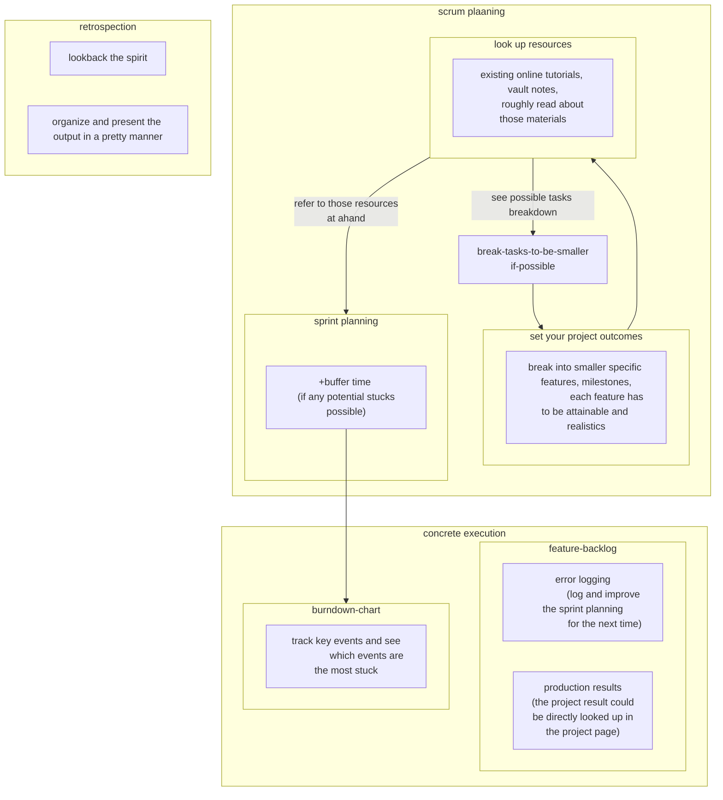

- Scrum created date: 

# Template frontmatter

- Created at csp vault in 6/6/2022.
- These scrum worksheet should be applied to "All projects". (Package theory, structural data theory of mine)
- A template of scrum project planning which could be a reusable framework to start and end a project. (Yes, it is located in the template folder)
- Each scrum should be an element of the collection of it. And there should be a page that could discover  the element of that collection, by the steps that better than "merely looking at the searching tab"

---

### Project objective
- One sentence to cover what is going to be achieve

### Study previous works

- Previous projects:
	- Does a collection of that project exist? If not, create one. If yes, go to that collection page and look at it. 
	- (Easy principle: If you have never did any projects before, you better follow some worked solution and done something with guidance. )
- Previous study: 
	- The study-timeline / discovery journey
		- From which date, to begin the study?
		- Which topic are covered? 

### Deliverable features list
- Guide:
	- Each feature should be as modular and simple as possible until you cannot spliting it smaller.
	
### Part 2:  Feature x N:  (One purpose only. Don't write any Product progress here!!)

- Guidelines: 
- 1. Copy / adopt the features list above.
- 2. Describe feature outcome in specific. 
	- Reduce the chance of scope creap
	- With specific outcome --> specific missing pieces --> discover more required resources before execution. 
- 3. Describe how to use resources to produce the outcome in detail
	- Reduce the chance of scope creap
	- Find the missing pieces or additional feature in the progress. 
- Try the best to order the feature list by dependency order, and the workers should work on feature in that sequence one-by-one.

- Feature 1: 
	- Description:
		- How will be it looks like when it is completed?
		- How to choose a result quality over variations of choices?
		- Are they attainable by the worker? Could it be more easy?
	- Production backlog
		- Write the abstract activity sequence here. 

---
### Part 2b: Further atomization
- list steps of preparing each feature, to see whether each tasks could be separate into a new project. 
- To do that, we propose 3~5 concrete steps for each feature to see if each steps is simple or complicated. 
- If it is complex, break it down into smaller features.

---

### Part 3: Separable-timebound

- Copy the feature list to a google sheet which could creates a burndown chart. 
	- Estimate the hours in the google sheet to produce a chart: https://docs.google.com/spreadsheets/d/14lb8HPqtVQnLikdGOqW1QlMW9_jK9zrHoSF-ftZSaI4/edit#gid=0

---

### Part 4: Sprint backlog
(3 ceremonies should be included in each sprint: 
	planning
	daily scrum  
	retrospective sprint review after completed should be included in the sprint)

### 4.1: Pre-planning and post-retrospection

#### Planning

#### Problem found during the sprint

### 4.2 Workout objects

- Feature M: Workout object: 

### 4.3 Documentations

- Feature K: Review and update the notes M.

---
## Reference

1. 

- Appendix: Action flow of planning a scrum:
