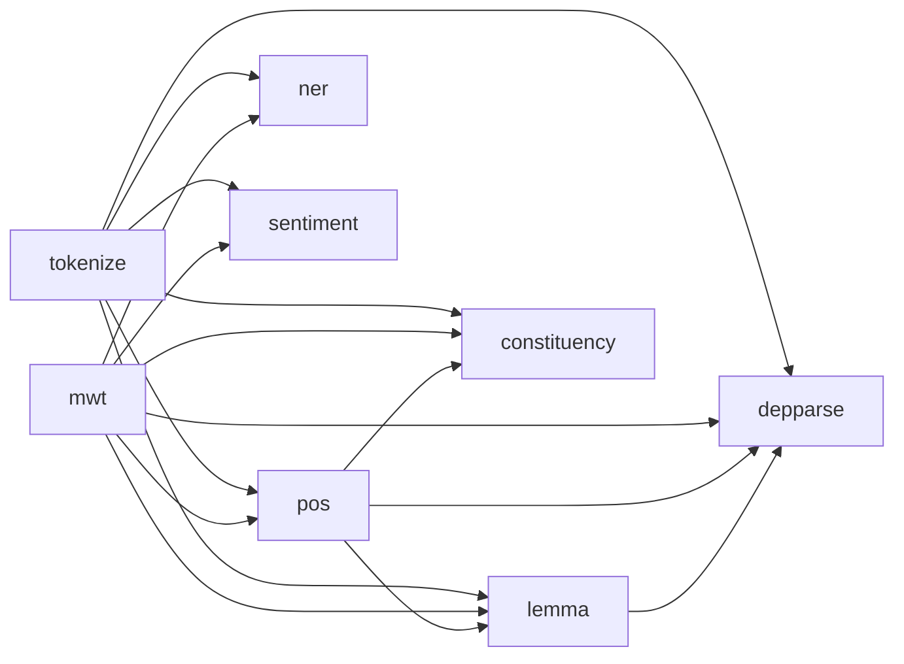

- 12-10-2022: created

- Superset:
	- [[tasks]]
	- [[NLP models]]

- These tasks are mostly related to producing annotations.

---
## List of text analysis [[tasks]]
- [[tagging problems over character sequence model]] (R1)
	- [[Tokenization]]
	- [[Multi-word token expansion]]
	- [[named entity recognition]]

- Non [[annotation]] tasks
	- [[sentence segmentation]]
	- classification tasks for a whole sentence or documents
	- Relation classificaiton
	- generation task (producing new text that is conditioned strongly on an input)

- [[Lexical analysis model]]
	- [[Lemmatization]]

- [[Syntactic analysis model]]
	- [[Morphological feature]]
	- [[part of speech]]

- [[Coreference resolution]]

- [[Sentiment]]

- [[Constituency parsing]]:
	- [[parse tree]]
	- [[lexicon]]
	- [[Treebank]]
	- Treebank as grammar

- [[Dependency parsing]]

---
- Constituency vs. Dependency Parsing

---
- Computational semantics and semantic parsing

---
## NLP processors dependencies

---
## Stanza object hierarchies

1. 

---
## List of downstream NLP tasks

- [[Text Summarization]]
- [[Question answering]]
- [[Information extraction]]
- [[bi-text retrieval]]
- [[Document classification]]
- [[Information retrieval]]

---
## Reference
1. [[(Paper) Qi, P., Zhang, Y., Zhang, Y., Bolton, J., & Manning, C. (2020). Sta n z a -- A Python Natural Language Processing Toolkit for Many Human Languages.]]